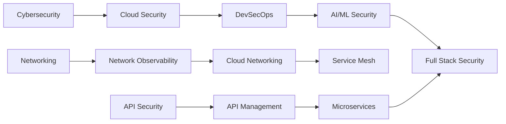

# 🌟 Niraj Bajpai's Curated Tech Repository Collection

> A comprehensive, categorized collection of **2,200+ starred repositories** spanning AI, Cybersecurity, Cloud, Networking, and Python Development — tailored to professional expertise and continuous learning.

[](https://www.linkedin.com/in/nirajbajpai)
[](https://github.com/nbajpai-code)
[](https://github.com/nbajpai-code?tab=stars)

---

## 📋 Table of Contents

- [👤 About](#-about)
- [🤖 Artificial Intelligence & Machine Learning](#-artificial-intelligence--machine-learning)
- [🔐 Cybersecurity & DevSecOps](#-cybersecurity--devsecops)
- [☁️ Cloud Infrastructure](#️-cloud-infrastructure)
- [🌐 Networking & Observability](#-networking--observability)
- [🔀 Networking Protocols](#-networking-protocols)
- [☸️ Cloud Native & CNCF](#️-cloud-native--cncf)
- [🐍 Python Development](#-python-development)
- [🎤 Conference Resources](#-conference-resources)
- [🏢 Enterprise Solutions (Broadcom/CA)](#-enterprise-solutions-broadcomca)
- [📚 Learning Resources](#-learning-resources)
- [🔧 Quick Links](#-quick-links)

---

## 👤 About

**Professional Background:**
- 🔐 **Cybersecurity Expert** - Microsoft Copilot for Security, Career Essentials in Cybersecurity
- ☁️ **Cloud Architect** - Azure AI Fundamentals, Azure Fundamentals, AWS Solutions Architect Associate
- 🤖 **AI Specialist** - Career Essentials in Generative AI, MCP/A2A protocols
- 🌐 **Network Professional** - DX NetOps, SMARTS, Network Observability
- 🔌 **API Security Architect** - API Product Manager, Designer, and Security Architect
- 💻 **DevSecOps Practitioner** - Infrastructure automation, CI/CD security

**What You'll Find Here:**
This repository serves as a curated index of my starred GitHub projects, organized by domain and use case. Each category reflects real-world professional interests and ongoing learning in cutting-edge technologies.

---

## 🤖 Artificial Intelligence & Machine Learning

### Leading AI Companies (~360 repos)

| Company | Focus Areas | Key Repositories |
|---------|-------------|------------------|
| **💚 NVIDIA** | GPU Computing, CUDA, AI Infrastructure | [Megatron-LM](https://github.com/NVIDIA/Megatron-LM), [NeMo](https://github.com/NVIDIA/NeMo), [TensorRT-LLM](https://github.com/NVIDIA/TensorRT-LLM), [DeepLearningExamples](https://github.com/NVIDIA/DeepLearningExamples) |
| **🟣 Anthropic** | Claude AI, SDKs, Tools | [anthropic-sdk-python](https://github.com/anthropics/anthropic-sdk-python), [claude-code](https://github.com/anthropics/claude-code), [anthropic-cookbook](https://github.com/anthropics/anthropic-cookbook), [courses](https://github.com/anthropics/courses) |
| **🔵 OpenAI** | GPT, Whisper, CLIP | [openai-python](https://github.com/openai/openai-python), [whisper](https://github.com/openai/whisper), [CLIP](https://github.com/openai/CLIP), [swarm](https://github.com/openai/swarm) |
| **🟦 Perplexity** | Search AI, MCP | [api-cookbook](https://github.com/perplexityai/api-cookbook), [modelcontextprotocol](https://github.com/perplexityai/modelcontextprotocol) |
| **🔵 META** | LLaMA, PyTorch, Research | [llama](https://github.com/meta-llama/llama), [llama3](https://github.com/meta-llama/llama3), [pytorch](https://github.com/pytorch/pytorch), [facebookresearch](https://github.com/facebookresearch) |
| **🔴 Google** | Gemini, TensorFlow, Research | [generative-ai-docs](https://github.com/google/generative-ai-docs), [tensorflow](https://github.com/tensorflow/tensorflow), [DeepMind](https://github.com/google-deepmind) |
| **💳 Capital One** | Federated Learning, Data Science | [federated-model-aggregation](https://github.com/capitalone/federated-model-aggregation), [datacompy](https://github.com/capitalone/datacompy), [rubicon-ml](https://github.com/capitalone/rubicon-ml) |

### NVIDIA Research (~13 repos)
- **Generative Models:** StyleGAN series, instant-ngp, Neuralangelo, Sana
- **3D Vision:** eg3d, kaolin, nvdiffrast
- **Frameworks:** tiny-cuda-nn, sionna

### AI Infrastructure & MLOps (~96 repos)

<details>
<summary>📊 View Categories</summary>

| Category | Count | Key Tools |
|----------|-------|-----------|
| **Model Serving** | 11 | vLLM, BentoML, TensorRT, TorchServe, KServe |
| **MLOps Platforms** | 10 | MLflow, DVC, Weights & Biases, ClearML, ZenML |
| **Distributed Training** | 8 | Ray, DeepSpeed, Horovod, ColossalAI |
| **Kubernetes ML** | 6 | Kubeflow, Volcano, KubeDL |
| **Model Fine-tuning** | 7 | LLaMA-Factory, PEFT, LoRA, QLoRA |
| **RAG & Vector DBs** | 7 | Milvus, Chroma, Qdrant, Weaviate, pgvector |
| **Model Optimization** | 8 | llama.cpp, GPTQ, ONNX, bitsandbytes |

</details>

### AI Frameworks & General (~48 repos)
- **Frameworks:** LangChain, LlamaIndex, Dify, CrewAI, AutoGen
- **Protocols:** Model Context Protocol (MCP), Agent2Agent (A2A)
- **Tools:** Awesome LLM Apps, Awesome Agents, Best AI Knowledge Repos

---

## 🔐 Cybersecurity & DevSecOps

### Security Coverage (~132 repos)

| Domain | Description | Notable Tools |
|--------|-------------|---------------|
| **🔒 OWASP Tools** | 12 repos | ZAP, Nettacker, Threat Dragon, DevSecOps Guideline, CheatSheets |
| **🔍 SAST** | 9 repos | GitHub CodeQL, Semgrep, SonarQube, TruffleHog, GitLeaks |
| **🎯 DAST** | 6 repos | StackHawk, ZAP, Nuclei, Subfinder |
| **📦 Container Security** | 8 repos | Trivy, Grype, Syft, Dockle, Checkov, Terrascan |
| **🔐 DevSecOps** | 6 repos | SLSA, Cosign, Rekor, in-toto, GitGuardian |
| **🔑 Secrets Management** | 6 repos | HashiCorp Vault, SOPS, Sealed Secrets, External Secrets |
| **☸️ K8s Security** | 7 repos | kube-bench, kube-hunter, Kubescape, kube-score |
| **📜 Policy** | 5 repos | Open Policy Agent, Gatekeeper, Kyverno, Falco |
| **🎯 Pentesting** | 6 repos | Metasploit, SQLMap, Bettercap, PEASS-ng |
| **🤖 Security Automation** | 5 repos | TheHive, MISP, StreamAlert |
| **👁️ Threat Detection** | 5 repos | Wazuh, OSSEC, Sigma, Elastic Rules |

### Microsoft Security (~4 repos)
- Microsoft 365 Defender Hunting Queries
- Azure Sentinel
- Windows Defender ATP Hunting Queries
- Microsoft Defender for Cloud

---

## ☁️ Cloud Infrastructure

### Multi-Cloud Support (~200 repos)

#### AWS Security (~9 repos)
```
aws-cli | aws-cdk | Prowler | ScoutSuite | Pacu | CloudSplaining
aws-security-reference-architecture | CloudSploit
```

#### Azure Security (~6 repos)
```
azure-cli | azure-sdk-for-python | Bicep | azure-policy
Azure Sentinel | DevOpsKit
```

#### Google Cloud Platform (~130 repos)
<details>
<summary>☁️ View GCP Categories</summary>

| Category | Description | Notable Repos |
|----------|-------------|---------------|
| **GCP Platform** | Core GCP services & tools | gemini-cloud-assist-mcp, gke-mcp, cloud-run-mcp, genai-factory |
| **Google Research** | AI/ML research projects | timesfm, android_world, omniglue, talk-like-a-graph |
| **Google DeepMind** | Advanced AI research | alphaevolve, superhuman, formal-imo, gemini-robotics-sdk |
| **Observability** | Security & monitoring | secops-toolkit, observability-and-security-operations-solution |
| **Data & Analytics** | BigQuery, Dataplex, Storage | dataplex-business-user-interface, lc-nl2sql, spanner-vector-hybrid-search-samples |

</details>

#### Oracle Cloud Infrastructure (~43 repos)
<details>
<summary>🔶 View OCI Categories</summary>

| Category | Tools |
|----------|-------|
| **OCI Core** | oci-cli, oci-python-sdk, terraform-provider-oci |
| **AI & ML** | langchain-oracle, python-select-ai, ai-optimizer, oci-mlflow |
| **Database** | nosql, adb-extproc, create-database-app, sql-developer-vscode |
| **Kubernetes** | oci-native-ingress-controller, oci-secrets-store-csi-driver-provider |
| **Development** | graal-dev-kit, guardian-ai, spring-cloud-oracle |

</details>

#### Infrastructure as Code (~8 repos)
| Tool | Language | Use Case |
|------|----------|----------|
| **Terraform** | HCL | Multi-cloud IaC |
| **Pulumi** | TypeScript/Python/Go | Programming language IaC |
| **TFLint** | Go | Terraform linting |
| **Terratest** | Go | IaC testing |
| **Terragrunt** | HCL | Terraform wrapper |

---

## 🌐 Networking & Observability

### Network Observability (~69 repos)

<details>
<summary>📊 Observability Stack</summary>

| Layer | Tools | Count |
|-------|-------|-------|
| **Platforms** | Netdata, SigNoz, Grafana, Uptrace, OpenObserve | 6 |
| **Metrics** | Prometheus, VictoriaMetrics, Mimir, Thanos, InfluxDB | 7 |
| **Logging** | Loki, Elasticsearch, Fluentd, Fluent Bit, Vector | 7 |
| **Tracing** | OpenTelemetry, Jaeger, Zipkin, Tempo | 7 |
| **eBPF Monitoring** | Cilium, Hubble, Pixie, BCC, bpftrace | 8 |
| **K8s Observability** | kube-state-metrics, Prometheus Operator, Kubeshark | 5 |

</details>

### Data Center Networking (~62 repos)

#### Cisco DxNetOps & SDN
- **Cisco Official:** Nexus9000, ACI, Intersight, NX-OS automation
- **Network Automation:** NAPALM, Nornir, Netmiko, Ansible
- **Source of Truth:** Nautobot, NetBox, DeviceType Library
- **SDN:** SONiC, OpenConfig, VPP

#### Container Networking
```
Calico | Cilium | Antrea | Flannel | Weave | CNI Plugins
```

### Cisco Network Observability Stack (~225 repos)

<details>
<summary>📡 Cisco Full-Stack Observability Platform</summary>

#### Cisco Open (~98 repos)
- **OpenTelemetry:** otel-js, otel-java, otel-py, otel-dotnet, otel-webserver-module
- **FSO Tools:** terraform-provider-observability, fsoc, fso-dashboard-examples
- **AppDynamics:** appd-client-go, terraform-provider-appd, appdynamics-k8s-webhook-instrumentor
- **ThousandEyes:** ansible-role-thousandeyes-enterprise-agent-linux
- **Network:** jalapeno, gnmi-client-examples, network-sketcher

#### Model-Driven Telemetry (4 repos)
| Platform | Repository | Description |
|----------|------------|-------------|
| **IOS XE** | cisco-ios-xe-mdt | YANG-based MDT for IOS XE |
| **IOS XR** | model-driven-telemetry | IOS XR telemetry protos |
| **NX-OS** | nx-telemetry-proto | NX-OS GPB/gRPC telemetry |
| **Multi-Platform** | network-programmability-stream | MDT examples |

#### Cisco Innovation Edge (~59 repos)
- **Telemetry:** bigmuddy-network-telemetry-pipeline, pipeline-gnmi, cisco-mdt-python
- **gRPC/gNMI:** ios-xr-grpc-python, cisco-gnmi-python, gnmi, gnmitest
- **Network Tools:** awesome-network-programmability, telemetry_stacks
- **Protocols:** cisco-proto, nx-telemetry-proto, yang-json-validator

#### DNA Center (8 repos)
```
awesome-cisco-dnac | DNAC-Top5 | DNAC-AURA | DNA_Analyzer
dnacenter_git_integrations | import-dnac-nso
```

#### Cisco Public Sector (~48 repos)
- **Network Automation:** ansible-viptela, viptela-ops, ansible-meraki
- **Observability:** cisco-splunk-mdt, grafana
- **Security:** cisco-cyber-vision, cybervisionapi

#### Network Programmability
- **pyATS/Genie:** CiscoTestAutomation/pyats, genieparser
- **YANG Models:** YangModels/yang, openconfig/public

</details>

**Cisco FSO Components:**
- ✅ **ThousandEyes** - Network performance monitoring
- ✅ **AppDynamics** - APM (Splunk Observability family)
- ✅ **Intersight** - Infrastructure management
- ✅ **Model-Driven Telemetry** - Streaming telemetry (IOS XE/XR, NX-OS)
- ✅ **DNA Center** - Network automation & analytics
- ✅ **NSO** - Service orchestration

---

## 🔀 Networking Protocols

### Routing Protocols & Network Infrastructure (~145 repos)

#### BGP (Border Gateway Protocol) (~7 repos)
<details>
<summary>🔀 View BGP Implementations</summary>

| Repository | Language | Description |
|------------|----------|-------------|
| **GoBGP** | Go | Modern BGP implementation with gRPC APIs |
| **RustyBGP** | Rust | High-performance, safe BGP implementation |
| **YABGP** | Python | Python BGP implementation for analysis |
| **BGP4J** | Java | BGP4 protocol in Java |
| **NIST BGP-SRx** | C | NIST BGP security extensions (RPKI, BGPsec) |

- **Security:** routing-anomaly-detection (USENIX Security 2024)
- **Use Cases:** eBGP, iBGP, RPKI validation, BMP monitoring

</details>

#### OSPF & ISIS (~7 repos)
<details>
<summary>🌐 View OSPF/ISIS Tools</summary>

| Tool | Description |
|------|-------------|
| **FRRouting (FRR)** | Complete routing suite (OSPF, ISIS, BGP, RIP) |
| **Topolograph** | Visualize OSPF/ISIS topology from LSDB |
| **OSPF-MDR** | OSPF MANET Designated Routers (RFCs 5614, 5243, 5838) |

**Educational Implementations:**
- OSPF in Java, C++, Python
- PWOSPF (simple version of OSPF)
- OSPF simulation environments

</details>

#### EVPN & VXLAN (~4 repos)
<details>
<summary>🏢 View EVPN/VXLAN Projects</summary>

- **evpn-for-ovn** - EVPN VXLAN implementation for OVN (L2VPN between data centers)
- **evpn** - EVPN-VXLAN Data Center workshop (Juniper QFX)
- **eveng-lab-evpn-vxlan** - Multi-tenant EVPN/VXLAN lab with Layer3 Leaf/Spine
- **techfest** - EVPN-VXLAN QFX Data Center workshop

**Technologies:** BGP EVPN, VXLAN overlay, ERB (Edge Routed Bridging)

</details>

#### SDN Controllers (~38 repos)
<details>
<summary>🎛️ View SDN Controller Projects</summary>

| Controller | Language | Best For | Repos |
|------------|----------|----------|-------|
| **OpenDaylight** | Java | Enterprise, large-scale deployments | ~20 |
| **ONOS** | Java | Service provider networks, distributed arch | ~15 |
| **Ryu** | Python | Research, prototyping, education | 1 |
| **POX** | Python | Academic research | 1 |
| **Floodlight** | Java | Campus networks | 1 |

**Features:**
- OpenDaylight: Latest features, best security, largest community
- ONOS: Clustering, scalability, brown field to green field transition
- Ryu: Simplicity, Python-based, extensive research use

</details>

#### MPLS, L2VPN, L3VPN (~4 repos)
<details>
<summary>🔗 View MPLS VPN Projects</summary>

- **mpls-vpns-all-in-one** - Comprehensive lab with EVPN, VPLS, VPWS, L3VPN, Segment-Routing (IOS-XR/XE)
- **clab_mpls_frr** - MPLS implementations using FRRouting with VRF and BGP L3 VPN
- **MPLS_Protocol** - Educational guide for CCNP/CCIE candidates
- **mpls-networking** - Juniper MPLS Core with L3VPN

**Technologies:** Label distribution, VRF, BGP VPN, Traffic Engineering

</details>

#### IPsec VPN (~3 repos)
<details>
<summary>🔐 View IPsec Implementations</summary>

| Implementation | Description |
|----------------|-------------|
| **strongSwan** | IPsec-based VPN for Linux, Android, FreeBSD, macOS, Windows |
| **Libreswan** | IPsec VPN with IKEv1/IKEv2 support |
| **VPN-IKEv2-LibreSWAN** | Scripts to build IPsec VPN server with IKEv2 |

**Protocols:** IKEv1, IKEv2, IPsec/L2TP, Cisco IPsec

</details>

#### 5G Core Network (~33 repos)
<details>
<summary>📡 View 5G Core Projects</summary>

| Project | Language | Compliance | Components |
|---------|----------|------------|------------|
| **Open5GS** | C | 3GPP R17 | 5G Core + EPC (4G/5G) |
| **free5GC** | Go | 3GPP R15+ | 5G-SA with MA-PDU sessions |
| **5G-Core-Network** | Combined | - | Combines Open5GS + free5GC capabilities |

**free5GC Organization (~30 additional repos):**
- Network functions: AMF, AUSF, N3IWF, NRF, NSSF, PCF
- Protocol libraries: NAS, NGAP, PFCP, OpenAPI
- Utilities: TimeDecode, logger, http_wrapper, fsm

**Use Cases:** Private 5G networks, edge computing, network slicing

</details>

#### Cisco AI Infrastructure (~9 repos)
<details>
<summary>🤖 View Cisco AI Projects</summary>

**CiscoAI Organization:**
- MLAnywhere - ML deployment anywhere
- Kubeflow/Katib - ML orchestration on Kubernetes
- MLPerf inference benchmarks
- AI toolkit for UCS X-series with NVIDIA GPUs (L4, L40S, H100, A100)

**Cisco AI PODs:**
- UCS C225/C220/C885A M8 servers
- Support for NVIDIA HGX and MGX platforms
- Cisco Nexus Hyperfabric AI networking

</details>

---

## ☸️ Cloud Native & CNCF

### Cloud Native Computing Foundation (~162 repos)

The CNCF hosts critical components of the global technology infrastructure, providing support for fast-growing cloud-native projects.

<details>
<summary>🎓 View CNCF Graduated Projects</summary>

| Project | Category | Description |
|---------|----------|-------------|
| **Kubernetes** | Orchestration | Container orchestration platform (kubernetes, minikube, dashboard, kubeadm, kops) |
| **Prometheus** | Monitoring | Metrics collection & alerting (prometheus, alertmanager, node_exporter) |
| **Envoy** | Networking | Cloud-native proxy (envoy, gateway, go-control-plane) |
| **CoreDNS** | DNS | DNS server for service discovery |
| **containerd** | Runtime | Container runtime (containerd, nerdctl) |
| **Fluentd** | Logging | Log collector & processor (fluentd, fluent-bit) |
| **Harbor** | Registry | Container image registry with security |
| **Helm** | Package Mgmt | Kubernetes package manager |
| **Jaeger** | Tracing | Distributed tracing system |
| **Argo** | GitOps | Workflows, CD, Rollouts, Events |
| **Flux** | GitOps | GitOps operator for Kubernetes |
| **Linkerd** | Service Mesh | Lightweight service mesh |
| **etcd** | Key-Value | Distributed key-value store |
| **Rook** | Storage | Cloud-native storage orchestrator |
| **Vitess** | Database | MySQL horizontal scaling |
| **TUF** | Security | Secure software update framework |

</details>

<details>
<summary>🌱 View CNCF Incubating Projects</summary>

| Project | Category | Description |
|---------|----------|-------------|
| **Cilium** | Networking | eBPF-based networking, observability & security (cilium, hubble, tetragon) |
| **Istio** | Service Mesh | Full-featured service mesh (istio, proxy) |
| **Knative** | Serverless | Kubernetes-based serverless (serving, eventing) |
| **Dapr** | Runtime | Distributed application runtime |
| **KubeEdge** | Edge Computing | Kubernetes native edge computing |
| **Cert-Manager** | Security | X.509 certificate management |
| **Crossplane** | Multi-cloud | Cloud-native control plane |
| **Contour** | Ingress | Kubernetes ingress controller |
| **OPA** | Policy | Open Policy Agent (opa, gatekeeper) |
| **Falco** | Security | Runtime security & threat detection |
| **Buildpacks** | Build | Cloud Native Buildpacks (pack, lifecycle) |
| **KubeVirt** | Virtualization | Virtual machine management |
| **Longhorn** | Storage | Cloud-native distributed block storage |
| **NATS** | Messaging | Cloud-native messaging system |
| **Notary** | Security | Secure content signing & verification |
| **Operator Framework** | Operators | Kubernetes operator SDK & lifecycle manager |
| **Thanos** | Monitoring | Highly available Prometheus setup |
| **Volcano** | Batch | Kubernetes batch scheduling |
| **KubeVela** | Application | Application delivery platform |
| **Backstage** | Portal | Developer portal for infrastructure |
| **Kyverno** | Policy | Kubernetes native policy management |

</details>

<details>
<summary>🧪 View CNCF Sandbox & Notable Projects</summary>

**Sandbox Projects:**
- **Kubescape** - Kubernetes security platform
- **Pixie** - Instant Kubernetes observability
- **OpenKruise** - Advanced workload management
- **k3s** - Lightweight Kubernetes distribution
- **k8sgpt** - AI-powered Kubernetes diagnostics
- **Paralus** - Zero trust access service

**Kubernetes SIGs:**
- kustomize, kind, cluster-api
- external-dns, kubespray, metrics-server
- gateway-api

**Service Mesh:**
- servicemeshinterface/smi-spec
- OpenTelemetry (collector, operator)

</details>

### CNCF Resources (~48 repos)
- **Landscape** - Cloud Native landscape visualization
- **Presentations** - Conference presentations archive
- **Glossary** - Cloud Native terminology
- **Trailmap** - Cloud Native journey guide
- **Technical Advisory Groups (TAGs):**
  - Security, Network, Storage
  - App Delivery, Runtime, Observability
  - Contributor Strategy

### KubeCon Presentations
- KubeCon-CloudNativeCon-Europe-2019 slides
- KubeCon-North-America-2018 slides

---

## 🐍 Python Development

### Well-Architected Python Projects (~136 repos)

<details>
<summary>🏗️ Categories & Best Practices</summary>

| Category | Key Projects | Purpose |
|----------|-------------|---------|
| **Clean Code** | clean-code-python, python-patterns, Cosmic Python | Architecture & best practices |
| **Web Frameworks** | Django, Flask, FastAPI, Starlette | Production-ready web apps |
| **ORM & Database** | SQLAlchemy, Tortoise ORM, Pony ORM | Database abstraction |
| **CLI Tools** | Rich, Typer, Click, Textual | Beautiful terminal UIs |
| **Testing** | pytest, Hypothesis, Robot Framework | Comprehensive testing |
| **Code Quality** | Ruff, Black, mypy, pylint, isort | Linting & formatting |
| **Async** | aiohttp, httpx, uvloop, Trio | Asynchronous programming |
| **Data Validation** | Pydantic, attrs, marshmallow | Type-safe data models |
| **Package Mgmt** | Poetry, PDM, uv, Pipenv | Modern dependency management |

</details>

### Learning Resources
- 30 Days of Python
- TheAlgorithms/Python
- Awesome Python
- System Design Primer

---

## 🎤 Conference Resources

### PyCon (~101 repos)

<details>
<summary>🐍 View PyCon Resources</summary>

**Python Software Foundation (~40 repos):**
- httpbin, requests, black, pyperf
- Advisory database, policies, education working groups
- PyPI stats, community code of conduct

**PyCon Conference (~28 repos):**
- PyCon.org, symposion, registrasion
- Slides from 2013-2019 conferences
- Badge generation, green room ops, progcom tools

**PyCon Tutorial Materials:**
- rasbt/pycon2024 - PyTorch deep learning fundamentals
- StefanUlbrich/PyCon2024 - Python & Rust scientific computation
- amyreese/pycon - Python conference talks archive

**Python India (~30 repos):**
- in.pycon.org, funnel, wye
- PyCon India 2012-2016 websites
- Junction (CfP management), mobile apps

</details>

### Ray Summit (~80 repos)

<details>
<summary>🚀 View Ray Summit Resources</summary>

**Anyscale (~50 repos):**
- Academy - Ray tutorials from Anyscale
- ray-summit-2022-training, ray-summit-2023-training
- datasets-database, llm-applications

**Ray Project (~30 repos):**
- ray - Main Ray framework for distributed AI
- kuberay - Ray on Kubernetes
- ray-llm, raycluster-operator
- Tutorial repositories and examples

</details>

### PyTorch Conference (~50 repos)

<details>
<summary>🔥 View PyTorch Resources</summary>

**PyTorch Organization:**
- pytorch/pytorch - Main PyTorch framework
- torchtune, torchchat, executorch
- vision, audio, text libraries
- TensorBoard, serve, ignite
- Examples, tutorials, and educational resources

</details>

---

## 🏢 Enterprise Solutions (Broadcom/CA)

### DX NetOps & Performance Management (~361 repos)

#### CA-PM (DX NetOps) - 29 repos
```
Key Apps:
├── OpenAPI-Grafana
├── WeatherMap-D3
├── Device-GeoTag
├── Baseline-Deviations
├── Interface-TopN
└── Polling Health Apps
```

#### CA-APM (Application Performance) - 79 repos
- Docker Monitoring, Kubernetes integration
- Field Packs: MongoDB, ActiveMQ, Nginx, Docker, Windows WMI
- EPAgent extensions for multiple platforms

#### CAAPIM (API Management) - 66 repos
- **Mobile SDKs:** iOS, Android, Cordova, Xamarin
- **Gateway:** Microgateway, Layer7 Operator, Helm Charts
- **Developer Tools:** Gateway Developer Plugin, Policy Plugins

#### Broadcom Inc - 100 repos
- Linux kernels, RDMA drivers, DPDK, SPDK
- Mainframe tools (Brightside)
- Security Analytics, Cloud Tools

#### CA Technologies - 87 repos
- Rally integration tools
- Blockchain tutorials
- DevTest solutions

---

## 🌐 API Security & Management

### API Gateways (~6 repos)
| Gateway | Type | Highlights |
|---------|------|------------|
| **Kong** | Enterprise/OSS | Plugin ecosystem, high performance |
| **Tyk** | OSS | Native security protocols (mTLS, OIDC) |
| **Apache APISIX** | OSS | Cloud-native, dynamic routing |
| **WSO2 API Manager** | OSS | Full lifecycle management |
| **Gravitee** | OSS | Event-driven APIs |
| **KrakenD** | OSS | High performance, stateless |

### API Security Tools (~7 repos)
```
OWASP API Security | Kiterunner | API Firewall | 42Crunch
VulnAPI | Katana | VAPI
```

---

## 📚 Learning Resources

### Curated Collections
- **Awesome Lists:** Security, Networking, Python, AI Infrastructure
- **Clean Code:** Python Best Practices, Design Patterns
- **Algorithms:** TheAlgorithms/Python, Data Structures
- **System Design:** System Design Primer, Distributed Systems

### Hands-On Learning
- 30 Days of Python
- 100 Days of ML Code
- Project-Based Learning
- ML ZoomCamp

---

## 🔧 Quick Links

### By Use Case

| Use Case | Recommended Repos |
|----------|-------------------|
| **🚀 Start AI Project** | LangChain, FastAPI, vLLM, MLflow |
| **🔒 Secure Pipeline** | Trivy, Semgrep, GitHub CodeQL, OWASP ZAP |
| **☁️ Cloud Deploy** | Terraform, Pulumi, K8s, Helm |
| **📊 Monitor Network** | Prometheus, Grafana, Cilium, NetBox |
| **🐍 Python Best Practices** | Black, Ruff, pytest, Pydantic |
| **🌐 API Gateway** | Kong, Tyk, APISIX |

### Professional Development Path



---

## 📊 Repository Statistics

| Category | Repositories | Key Focus |
|----------|--------------|-----------|
| 🤖 **AI & ML** | ~504 | LLMs, Infrastructure, META, Google, Capital One |
| 🔐 **Cybersecurity** | ~132 | SAST, DAST, K8s Security, DevSecOps |
| ☁️ **Cloud** | ~200 | AWS, Azure, Google Cloud, Oracle Cloud, IaC |
| 🌐 **Networking & Observability** | ~356 | Observability, Data Center, Cisco FSO |
| 🔀 **Networking Protocols** | ~145 | BGP, OSPF, EVPN, SDN, MPLS, 5G Core, IPsec |
| ☸️ **Cloud Native & CNCF** | ~162 | Kubernetes, Prometheus, Envoy, Service Mesh, GitOps |
| 🐍 **Python** | ~136 | Frameworks, Tools, Best Practices |
| 🎤 **Conference Resources** | ~231 | PyCon, KubeCon, Ray Summit, PyTorch |
| 🏢 **Broadcom/CA** | ~361 | DxNetOps, APM, API Management |
| 🌐 **API** | ~13 | Gateways, Security |
| **TOTAL** | **~2,240** | **Complete Enterprise Tech Stack** ⭐ |

### AI & ML Breakdown:
- Original AI companies (NVIDIA, Anthropic, OpenAI, Perplexity): 94 repos
- AI Infrastructure & MLOps: 96 repos
- AI Frameworks: 48 repos
- **META (LLaMA, PyTorch, FacebookResearch): ~66 repos** ⭐ NEW!
- **Google (GCP, Research, DeepMind, TensorFlow): ~130 repos** ⭐ NEW!
- **Capital One (Data Science, ML tools): ~49 repos** ⭐ NEW!
- **Cisco AI Infrastructure: ~9 repos** ⭐ NEW!

### Networking Breakdown:
- General Network Observability: 69 repos
- Data Center Networking: 62 repos
- **Cisco Observability Stack: 225 repos**
- **BGP Routing: 7 repos** ⭐ NEW!
- **OSPF & ISIS: 7 repos** ⭐ NEW!
- **EVPN & VXLAN: 4 repos** ⭐ NEW!
- **SDN Controllers: 38 repos** ⭐ NEW!
- **MPLS/VPN: 4 repos** ⭐ NEW!
- **IPsec VPN: 3 repos** ⭐ NEW!
- **5G Core: 33 repos** ⭐ NEW!

### Cloud Breakdown:
- AWS: 9 repos
- Azure: 6 repos
- **Google Cloud Platform: ~130 repos** ⭐ NEW!
- **Oracle Cloud Infrastructure: ~43 repos** ⭐ NEW!
- Infrastructure as Code: 8 repos

---

## 🎯 Current Focus Areas (2025)

1. **🤖 Agentic AI Development**
   - Multi-agent orchestration (MCP, A2A protocols)
   - LLM fine-tuning and deployment
   - RAG architectures

2. **🔐 Cloud Security Automation**
   - DevSecOps pipelines
   - Container & K8s security
   - Infrastructure scanning

3. **🌐 Network Observability**
   - eBPF-based monitoring
   - Service mesh observability
   - AI-powered analytics

4. **🐍 Python Excellence**
   - Clean architecture patterns
   - Modern CLI development
   - Async programming

---

## 🤝 Connect

- 💼 **LinkedIn:** [linkedin.com/in/nirajbajpai](https://www.linkedin.com/in/nirajbajpai)
- 🐙 **GitHub:** [github.com/nbajpai-code](https://github.com/nbajpai-code)
- ⭐ **Stars:** [View All Starred Repos](https://github.com/nbajpai-code?tab=stars)

---

## 📝 Notes

- **Last Updated:** November 2025
- **Maintenance:** Regularly updated with new discoveries and industry trends
- **Purpose:** Professional development, continuous learning, and community engagement

---

<div align="center">

**🌟 Curated with expertise | Built for continuous learning | Shared for community impact 🌟**

[](https://github.com/nbajpai-code?tab=stars)

</div>

---

## 🔖 Quick Start Scripts

All repositories can be starred using the automated scripts in `~/`:

```bash
# AI & ML
~/star_ai_repos.sh
~/star_ai_infrastructure_repos.sh
~/star_ai_companies_repos.sh

# Security & Cloud
~/star_security_cloud_api_repos.sh

# Networking
~/star_network_observability_repos.sh
~/star_datacenter_network_repos.sh

# Python
~/star_python_projects_repos.sh

# Broadcom/CA
~/star_broadcom_repos.sh
```

---

*This index is a living document reflecting ongoing professional development in cybersecurity, cloud architecture, AI/ML, networking, and software engineering best practices.*
