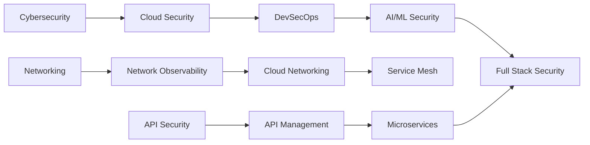

# 🌟 Niraj Bajpai's Curated Tech Repository Collection

> A comprehensive, categorized collection of **700+ starred repositories** spanning AI, Cybersecurity, Cloud, Networking, and Python Development — tailored to professional expertise and continuous learning.

[](https://www.linkedin.com/in/nirajbajpai)
[](https://github.com/nbajpai-code)
[](https://github.com/nbajpai-code?tab=stars)

---

## 📋 Table of Contents

- [👤 About](#-about)
- [🤖 Artificial Intelligence & Machine Learning](#-artificial-intelligence--machine-learning)
- [🔐 Cybersecurity & DevSecOps](#-cybersecurity--devsecops)
- [☁️ Cloud Infrastructure](#️-cloud-infrastructure)
- [🌐 Networking & Observability](#-networking--observability)
- [🐍 Python Development](#-python-development)
- [🏢 Enterprise Solutions (Broadcom/CA)](#-enterprise-solutions-broadcomca)
- [📚 Learning Resources](#-learning-resources)
- [🔧 Quick Links](#-quick-links)

---

## 👤 About

**Professional Background:**
- 🔐 **Cybersecurity Expert** - Microsoft Copilot for Security, Career Essentials in Cybersecurity
- ☁️ **Cloud Architect** - Azure AI Fundamentals, Azure Fundamentals, AWS Solutions Architect Associate
- 🤖 **AI Specialist** - Career Essentials in Generative AI, MCP/A2A protocols
- 🌐 **Network Professional** - DX NetOps, SMARTS, Network Observability
- 🔌 **API Security Architect** - API Product Manager, Designer, and Security Architect
- 💻 **DevSecOps Practitioner** - Infrastructure automation, CI/CD security

**What You'll Find Here:**
This repository serves as a curated index of my starred GitHub projects, organized by domain and use case. Each category reflects real-world professional interests and ongoing learning in cutting-edge technologies.

---

## 🤖 Artificial Intelligence & Machine Learning

### Leading AI Companies (~94 repos)

| Company | Focus Areas | Key Repositories |
|---------|-------------|------------------|
| **💚 NVIDIA** | GPU Computing, CUDA, AI Infrastructure | [Megatron-LM](https://github.com/NVIDIA/Megatron-LM), [NeMo](https://github.com/NVIDIA/NeMo), [TensorRT-LLM](https://github.com/NVIDIA/TensorRT-LLM), [DeepLearningExamples](https://github.com/NVIDIA/DeepLearningExamples) |
| **🟣 Anthropic** | Claude AI, SDKs, Tools | [anthropic-sdk-python](https://github.com/anthropics/anthropic-sdk-python), [claude-code](https://github.com/anthropics/claude-code), [anthropic-cookbook](https://github.com/anthropics/anthropic-cookbook), [courses](https://github.com/anthropics/courses) |
| **🔵 OpenAI** | GPT, Whisper, CLIP | [openai-python](https://github.com/openai/openai-python), [whisper](https://github.com/openai/whisper), [CLIP](https://github.com/openai/CLIP), [swarm](https://github.com/openai/swarm) |
| **🟦 Perplexity** | Search AI, MCP | [api-cookbook](https://github.com/perplexityai/api-cookbook), [modelcontextprotocol](https://github.com/perplexityai/modelcontextprotocol) |

### NVIDIA Research (~13 repos)
- **Generative Models:** StyleGAN series, instant-ngp, Neuralangelo, Sana
- **3D Vision:** eg3d, kaolin, nvdiffrast
- **Frameworks:** tiny-cuda-nn, sionna

### AI Infrastructure & MLOps (~96 repos)

<details>
<summary>📊 View Categories</summary>

| Category | Count | Key Tools |
|----------|-------|-----------|
| **Model Serving** | 11 | vLLM, BentoML, TensorRT, TorchServe, KServe |
| **MLOps Platforms** | 10 | MLflow, DVC, Weights & Biases, ClearML, ZenML |
| **Distributed Training** | 8 | Ray, DeepSpeed, Horovod, ColossalAI |
| **Kubernetes ML** | 6 | Kubeflow, Volcano, KubeDL |
| **Model Fine-tuning** | 7 | LLaMA-Factory, PEFT, LoRA, QLoRA |
| **RAG & Vector DBs** | 7 | Milvus, Chroma, Qdrant, Weaviate, pgvector |
| **Model Optimization** | 8 | llama.cpp, GPTQ, ONNX, bitsandbytes |

</details>

### AI Frameworks & General (~48 repos)
- **Frameworks:** LangChain, LlamaIndex, Dify, CrewAI, AutoGen
- **Protocols:** Model Context Protocol (MCP), Agent2Agent (A2A)
- **Tools:** Awesome LLM Apps, Awesome Agents, Best AI Knowledge Repos

---

## 🔐 Cybersecurity & DevSecOps

### Security Coverage (~132 repos)

| Domain | Description | Notable Tools |
|--------|-------------|---------------|
| **🔒 OWASP Tools** | 12 repos | ZAP, Nettacker, Threat Dragon, DevSecOps Guideline, CheatSheets |
| **🔍 SAST** | 9 repos | GitHub CodeQL, Semgrep, SonarQube, TruffleHog, GitLeaks |
| **🎯 DAST** | 6 repos | StackHawk, ZAP, Nuclei, Subfinder |
| **📦 Container Security** | 8 repos | Trivy, Grype, Syft, Dockle, Checkov, Terrascan |
| **🔐 DevSecOps** | 6 repos | SLSA, Cosign, Rekor, in-toto, GitGuardian |
| **🔑 Secrets Management** | 6 repos | HashiCorp Vault, SOPS, Sealed Secrets, External Secrets |
| **☸️ K8s Security** | 7 repos | kube-bench, kube-hunter, Kubescape, kube-score |
| **📜 Policy** | 5 repos | Open Policy Agent, Gatekeeper, Kyverno, Falco |
| **🎯 Pentesting** | 6 repos | Metasploit, SQLMap, Bettercap, PEASS-ng |
| **🤖 Security Automation** | 5 repos | TheHive, MISP, StreamAlert |
| **👁️ Threat Detection** | 5 repos | Wazuh, OSSEC, Sigma, Elastic Rules |

### Microsoft Security (~4 repos)
- Microsoft 365 Defender Hunting Queries
- Azure Sentinel
- Windows Defender ATP Hunting Queries
- Microsoft Defender for Cloud

---

## ☁️ Cloud Infrastructure

### Multi-Cloud Support (~23 repos)

#### AWS Security (~9 repos)
```
aws-cli | aws-cdk | Prowler | ScoutSuite | Pacu | CloudSplaining
aws-security-reference-architecture | CloudSploit
```

#### Azure Security (~6 repos)
```
azure-cli | azure-sdk-for-python | Bicep | azure-policy
Azure Sentinel | DevOpsKit
```

#### Infrastructure as Code (~8 repos)
| Tool | Language | Use Case |
|------|----------|----------|
| **Terraform** | HCL | Multi-cloud IaC |
| **Pulumi** | TypeScript/Python/Go | Programming language IaC |
| **TFLint** | Go | Terraform linting |
| **Terratest** | Go | IaC testing |
| **Terragrunt** | HCL | Terraform wrapper |

---

## 🌐 Networking & Observability

### Network Observability (~69 repos)

<details>
<summary>📊 Observability Stack</summary>

| Layer | Tools | Count |
|-------|-------|-------|
| **Platforms** | Netdata, SigNoz, Grafana, Uptrace, OpenObserve | 6 |
| **Metrics** | Prometheus, VictoriaMetrics, Mimir, Thanos, InfluxDB | 7 |
| **Logging** | Loki, Elasticsearch, Fluentd, Fluent Bit, Vector | 7 |
| **Tracing** | OpenTelemetry, Jaeger, Zipkin, Tempo | 7 |
| **eBPF Monitoring** | Cilium, Hubble, Pixie, BCC, bpftrace | 8 |
| **K8s Observability** | kube-state-metrics, Prometheus Operator, Kubeshark | 5 |

</details>

### Data Center Networking (~62 repos)

#### Cisco DxNetOps & SDN
- **Cisco Official:** Nexus9000, ACI, Intersight, NX-OS automation
- **Network Automation:** NAPALM, Nornir, Netmiko, Ansible
- **Source of Truth:** Nautobot, NetBox, DeviceType Library
- **SDN:** SONiC, OpenConfig, VPP

#### Container Networking
```
Calico | Cilium | Antrea | Flannel | Weave | CNI Plugins
```

---

## 🐍 Python Development

### Well-Architected Python Projects (~136 repos)

<details>
<summary>🏗️ Categories & Best Practices</summary>

| Category | Key Projects | Purpose |
|----------|-------------|---------|
| **Clean Code** | clean-code-python, python-patterns, Cosmic Python | Architecture & best practices |
| **Web Frameworks** | Django, Flask, FastAPI, Starlette | Production-ready web apps |
| **ORM & Database** | SQLAlchemy, Tortoise ORM, Pony ORM | Database abstraction |
| **CLI Tools** | Rich, Typer, Click, Textual | Beautiful terminal UIs |
| **Testing** | pytest, Hypothesis, Robot Framework | Comprehensive testing |
| **Code Quality** | Ruff, Black, mypy, pylint, isort | Linting & formatting |
| **Async** | aiohttp, httpx, uvloop, Trio | Asynchronous programming |
| **Data Validation** | Pydantic, attrs, marshmallow | Type-safe data models |
| **Package Mgmt** | Poetry, PDM, uv, Pipenv | Modern dependency management |

</details>

### Learning Resources
- 30 Days of Python
- TheAlgorithms/Python
- Awesome Python
- System Design Primer

---

## 🏢 Enterprise Solutions (Broadcom/CA)

### DX NetOps & Performance Management (~361 repos)

#### CA-PM (DX NetOps) - 29 repos
```
Key Apps:
├── OpenAPI-Grafana
├── WeatherMap-D3
├── Device-GeoTag
├── Baseline-Deviations
├── Interface-TopN
└── Polling Health Apps
```

#### CA-APM (Application Performance) - 79 repos
- Docker Monitoring, Kubernetes integration
- Field Packs: MongoDB, ActiveMQ, Nginx, Docker, Windows WMI
- EPAgent extensions for multiple platforms

#### CAAPIM (API Management) - 66 repos
- **Mobile SDKs:** iOS, Android, Cordova, Xamarin
- **Gateway:** Microgateway, Layer7 Operator, Helm Charts
- **Developer Tools:** Gateway Developer Plugin, Policy Plugins

#### Broadcom Inc - 100 repos
- Linux kernels, RDMA drivers, DPDK, SPDK
- Mainframe tools (Brightside)
- Security Analytics, Cloud Tools

#### CA Technologies - 87 repos
- Rally integration tools
- Blockchain tutorials
- DevTest solutions

---

## 🌐 API Security & Management

### API Gateways (~6 repos)
| Gateway | Type | Highlights |
|---------|------|------------|
| **Kong** | Enterprise/OSS | Plugin ecosystem, high performance |
| **Tyk** | OSS | Native security protocols (mTLS, OIDC) |
| **Apache APISIX** | OSS | Cloud-native, dynamic routing |
| **WSO2 API Manager** | OSS | Full lifecycle management |
| **Gravitee** | OSS | Event-driven APIs |
| **KrakenD** | OSS | High performance, stateless |

### API Security Tools (~7 repos)
```
OWASP API Security | Kiterunner | API Firewall | 42Crunch
VulnAPI | Katana | VAPI
```

---

## 📚 Learning Resources

### Curated Collections
- **Awesome Lists:** Security, Networking, Python, AI Infrastructure
- **Clean Code:** Python Best Practices, Design Patterns
- **Algorithms:** TheAlgorithms/Python, Data Structures
- **System Design:** System Design Primer, Distributed Systems

### Hands-On Learning
- 30 Days of Python
- 100 Days of ML Code
- Project-Based Learning
- ML ZoomCamp

---

## 🔧 Quick Links

### By Use Case

| Use Case | Recommended Repos |
|----------|-------------------|
| **🚀 Start AI Project** | LangChain, FastAPI, vLLM, MLflow |
| **🔒 Secure Pipeline** | Trivy, Semgrep, GitHub CodeQL, OWASP ZAP |
| **☁️ Cloud Deploy** | Terraform, Pulumi, K8s, Helm |
| **📊 Monitor Network** | Prometheus, Grafana, Cilium, NetBox |
| **🐍 Python Best Practices** | Black, Ruff, pytest, Pydantic |
| **🌐 API Gateway** | Kong, Tyk, APISIX |

### Professional Development Path



---

## 📊 Repository Statistics

| Category | Repositories | Key Focus |
|----------|--------------|-----------|
| 🤖 **AI & ML** | ~238 | LLMs, Infrastructure, Training |
| 🔐 **Cybersecurity** | ~132 | SAST, DAST, K8s Security, DevSecOps |
| ☁️ **Cloud** | ~23 | AWS, Azure, IaC |
| 🌐 **Networking** | ~131 | Observability, Data Center, Cisco |
| 🐍 **Python** | ~136 | Frameworks, Tools, Best Practices |
| 🏢 **Broadcom/CA** | ~361 | DxNetOps, APM, API Management |
| 🌐 **API** | ~13 | Gateways, Security |
| **TOTAL** | **~1,034** | Comprehensive Tech Stack |

---

## 🎯 Current Focus Areas (2025)

1. **🤖 Agentic AI Development**
   - Multi-agent orchestration (MCP, A2A protocols)
   - LLM fine-tuning and deployment
   - RAG architectures

2. **🔐 Cloud Security Automation**
   - DevSecOps pipelines
   - Container & K8s security
   - Infrastructure scanning

3. **🌐 Network Observability**
   - eBPF-based monitoring
   - Service mesh observability
   - AI-powered analytics

4. **🐍 Python Excellence**
   - Clean architecture patterns
   - Modern CLI development
   - Async programming

---

## 🤝 Connect

- 💼 **LinkedIn:** [linkedin.com/in/nirajbajpai](https://www.linkedin.com/in/nirajbajpai)
- 🐙 **GitHub:** [github.com/nbajpai-code](https://github.com/nbajpai-code)
- ⭐ **Stars:** [View All Starred Repos](https://github.com/nbajpai-code?tab=stars)

---

## 📝 Notes

- **Last Updated:** November 2025
- **Maintenance:** Regularly updated with new discoveries and industry trends
- **Purpose:** Professional development, continuous learning, and community engagement

---

<div align="center">

**🌟 Curated with expertise | Built for continuous learning | Shared for community impact 🌟**

[](https://github.com/nbajpai-code?tab=stars)

</div>

---

## 🔖 Quick Start Scripts

All repositories can be starred using the automated scripts in `~/`:

```bash
# AI & ML
~/star_ai_repos.sh
~/star_ai_infrastructure_repos.sh
~/star_ai_companies_repos.sh

# Security & Cloud
~/star_security_cloud_api_repos.sh

# Networking
~/star_network_observability_repos.sh
~/star_datacenter_network_repos.sh

# Python
~/star_python_projects_repos.sh

# Broadcom/CA
~/star_broadcom_repos.sh
```

---

*This index is a living document reflecting ongoing professional development in cybersecurity, cloud architecture, AI/ML, networking, and software engineering best practices.*
