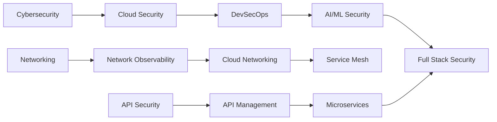

# 🌟 Niraj Bajpai's Curated Tech Repository Collection

> A comprehensive, categorized collection of **3,100+ starred repositories** spanning AI, MLOps, AIOps, Cybersecurity, Cloud, Networking, Systems Programming (C++/Go/LLVM), Python Development, Quality Engineering, Database Technologies, Quantum & Emerging Technologies, and Conferences (Python, Tech, Data Center, Security & Enterprise) — tailored to professional expertise and continuous learning.

[](https://www.linkedin.com/in/nirajbajpai)
[](https://github.com/nbajpai-code)
[](https://github.com/nbajpai-code?tab=stars)

**📌 NEW:** [**Clickable Starred Index →**](STARRED-INDEX.md) - Easy navigation through all 3,100+ starred repos with direct links!

---

## 📋 Table of Contents

- [👤 About](#-about)
- [🤖 Artificial Intelligence & Machine Learning](#-artificial-intelligence--machine-learning)
- [🤖 AIOps - AI for IT Operations](#-aiops---ai-for-it-operations)
- [🔐 Cybersecurity & DevSecOps](#-cybersecurity--devsecops)
- [☁️ Cloud Infrastructure](#️-cloud-infrastructure)
- [🌐 Networking & Observability](#-networking--observability)
- [🔀 Networking Protocols](#-networking-protocols)
- [☸️ Cloud Native & CNCF](#️-cloud-native--cncf)
- [⚡ Systems Programming (C++, Go, LLVM)](#-systems-programming-c-go-llvm)
- [🐍 Python Development](#-python-development)
- [🎤 Conference Resources](#-conference-resources)
- [🐍 Python Conferences](#-python-conferences)
- [💼 Tech Conferences](#-tech-conferences)
- [🏗️ Data Center Conferences](#️-data-center-conferences)
- [🔒 Security & Enterprise Conferences](#-security--enterprise-conferences)
- [🤖 AI Coding Agents & Benchmarks](#-ai-coding-agents--benchmarks)
- [🧪 Quality Engineering & Testing](#-quality-engineering--testing)
- [🗄️ Database Technologies](#️-database-technologies)
- [🔬 Quantum & Emerging Technologies](#-quantum--emerging-technologies)
- [🏢 Enterprise Solutions (Broadcom/CA)](#-enterprise-solutions-broadcomca)
- [🌐 API Security & Management](#-api-security--management)
- [📚 Learning Resources](#-learning-resources)
- [🔧 Quick Links](#-quick-links)

---

## 👤 About

**Professional Background:**
- 🔐 **Cybersecurity Expert** - Microsoft Copilot for Security, Career Essentials in Cybersecurity
- ☁️ **Cloud Architect** - Azure AI Fundamentals, Azure Fundamentals, AWS Solutions Architect Associate
- 🤖 **AI Specialist** - Career Essentials in Generative AI, MCP/A2A protocols
- 🌐 **Network Professional** - DX NetOps, SMARTS, Network Observability
- 🔌 **API Security Architect** - API Product Manager, Designer, and Security Architect
- 💻 **DevSecOps Practitioner** - Infrastructure automation, CI/CD security

**What You'll Find Here:**
This repository serves as a curated index of my starred GitHub projects, organized by domain and use case. Each category reflects real-world professional interests and ongoing learning in cutting-edge technologies.

---

## 🤖 Artificial Intelligence & Machine Learning

### Leading AI Companies (~360 repos)

| Company | Focus Areas | Key Repositories |
|---------|-------------|------------------|
| **💚 NVIDIA** | GPU Computing, CUDA, AI Infrastructure | [Megatron-LM](https://github.com/NVIDIA/Megatron-LM), [NeMo](https://github.com/NVIDIA/NeMo), [TensorRT-LLM](https://github.com/NVIDIA/TensorRT-LLM), [DeepLearningExamples](https://github.com/NVIDIA/DeepLearningExamples) |
| **🟣 Anthropic** | Claude AI, SDKs, Tools | [anthropic-sdk-python](https://github.com/anthropics/anthropic-sdk-python), [claude-code](https://github.com/anthropics/claude-code), [anthropic-cookbook](https://github.com/anthropics/anthropic-cookbook), [courses](https://github.com/anthropics/courses) |
| **🔵 OpenAI** | GPT, Whisper, CLIP | [openai-python](https://github.com/openai/openai-python), [whisper](https://github.com/openai/whisper), [CLIP](https://github.com/openai/CLIP), [swarm](https://github.com/openai/swarm) |
| **🟦 Perplexity** | Search AI, MCP | [api-cookbook](https://github.com/perplexityai/api-cookbook), [modelcontextprotocol](https://github.com/perplexityai/modelcontextprotocol) |
| **🔵 META** | LLaMA, PyTorch, Research | [llama](https://github.com/meta-llama/llama), [llama3](https://github.com/meta-llama/llama3), [pytorch](https://github.com/pytorch/pytorch), [facebookresearch](https://github.com/facebookresearch) |
| **🔴 Google** | Gemini, TensorFlow, Research | [generative-ai-docs](https://github.com/google/generative-ai-docs), [tensorflow](https://github.com/tensorflow/tensorflow), [DeepMind](https://github.com/google-deepmind) |
| **💳 Capital One** | Federated Learning, Data Science | [federated-model-aggregation](https://github.com/capitalone/federated-model-aggregation), [datacompy](https://github.com/capitalone/datacompy), [rubicon-ml](https://github.com/capitalone/rubicon-ml) |

### NVIDIA Research (~13 repos)
- **Generative Models:** StyleGAN series, instant-ngp, Neuralangelo, Sana
- **3D Vision:** eg3d, kaolin, nvdiffrast
- **Frameworks:** tiny-cuda-nn, sionna

### AI Infrastructure & MLOps (~115 repos)

<details>
<summary>📊 View MLOps Categories</summary>

#### Core MLOps Platforms (~19 repos)
| Platform | Purpose | Key Features |
|----------|---------|--------------|
| **MLflow** | End-to-end ML lifecycle | Experiment tracking, versioning, deployment |
| **Kubeflow** | ML workflows on K8s | Pipeline orchestration, scalability |
| **DVC** | Data Version Control | Git-like versioning for datasets/models |
| **Metaflow** (Netflix) | Human-centric ML workflows | Real-world use cases focus |
| **Seldon Core** | K8s ML deployment | Monitoring, scaling, A/B testing |
| **ClearML** | Auto-Magical CI/CD | ML workflow automation |
| **CML** | CI/CD for ML | Machine learning project automation |
| **KitOps** | MLOps handoffs | Data scientists to DevOps integration |
| **ZenML** | Extensible MLOps | Framework for ML pipelines |
| **Feast** | Feature store | ML feature management |
| **BentoML** | Production ML services | Model serving framework |

#### Hyperparameter Optimization (~4 repos)
- **Optuna** - Hyperparameter optimization framework (TPE, grid search)
- **scikit-optimize** - Minimize expensive black-box functions
- **Talos** - Hyperparameter optimization for TensorFlow, Keras, PyTorch
- **Ray Tune** - Experiment execution and hyperparameter tuning at scale

#### Model Serving & Deployment (~11 repos)
- vLLM, BentoML, TensorRT, TorchServe, KServe, Seldon Core
- Model optimization: ONNX, TensorFlow Serving

#### Distributed Training (~8 repos)
- Ray, DeepSpeed, Horovod, ColossalAI

#### Kubernetes ML (~6 repos)
- Kubeflow, Volcano, KubeDL

#### Model Fine-tuning (~7 repos)
- LLaMA-Factory, PEFT, LoRA, QLoRA

#### RAG & Vector DBs (~7 repos)
- Milvus, Chroma, Qdrant, Weaviate, pgvector

#### Model Optimization (~8 repos)
- llama.cpp, GPTQ, ONNX, bitsandbytes

#### Learning Resources
- **awesome-mlops** (kelvins) - Curated list of MLOps tools
- **awesome-mlops-platforms** - Open source & commercial platforms
- **Made-With-ML** (GokuMohandas) - Production ML best practices

</details>

### AI Frameworks & General (~48 repos)
- **Frameworks:** LangChain, LlamaIndex, Dify, CrewAI, AutoGen
- **Protocols:** Model Context Protocol (MCP), Agent2Agent (A2A)
- **Tools:** Awesome LLM Apps, Awesome Agents, Best AI Knowledge Repos

---

## 🤖 AIOps - AI for IT Operations

### Open Source AIOps Platforms (~10 repos)

<details>
<summary>🎯 View AIOps Tools</summary>

#### Core AIOps Platforms
| Platform | Description | Key Features |
|----------|-------------|--------------|
| **Keep** (keephq/keep) | Open-source AIOps & alert management | GitHub Actions for monitoring, YAML workflows |
| **AIOpsLab** (microsoft) | Autonomous AIOps agents framework | MLSys'25, microservice environments, fault injection |
| **awesome-AIOps** (OpsPAI) | Curated academic & industrial materials | Research papers, tools, best practices |

#### Anomaly Detection & Root Cause Analysis
- **Loglizer** (logpai) - Machine learning toolkit for log-based anomaly detection
- **SREWorks** (alibaba) - Cloud-native data platform for AIOps
- **Luminol** (linkedin) - Anomaly detection and correlation library
- **NuPIC** (numenta) - Numenta Platform for Intelligent Computing
- **Skyline** (earthgecko) - Real-time anomaly detection system

#### Key Features & Integrations
- **Observability Integration:** Prometheus, Grafana, Datadog, ELK stack
- **AI Anomaly Detection:** Direct integration into CI/CD pipelines
- **Commercial Platforms:** Datadog, Dynatrace (Davis AI), Moogsoft, BigPanda
- **Use Cases:** Automatic problem detection, root cause analysis, alert correlation

</details>

---

## 🔐 Cybersecurity & DevSecOps

### Security Coverage (~132 repos)

| Domain | Description | Notable Tools |
|--------|-------------|---------------|
| **🔒 OWASP Tools** | 12 repos | ZAP, Nettacker, Threat Dragon, DevSecOps Guideline, CheatSheets |
| **🔍 SAST** | 9 repos | GitHub CodeQL, Semgrep, SonarQube, TruffleHog, GitLeaks |
| **🎯 DAST** | 6 repos | StackHawk, ZAP, Nuclei, Subfinder |
| **📦 Container Security** | 8 repos | Trivy, Grype, Syft, Dockle, Checkov, Terrascan |
| **🔐 DevSecOps** | 6 repos | SLSA, Cosign, Rekor, in-toto, GitGuardian |
| **🔑 Secrets Management** | 6 repos | HashiCorp Vault, SOPS, Sealed Secrets, External Secrets |
| **☸️ K8s Security** | 7 repos | kube-bench, kube-hunter, Kubescape, kube-score |
| **📜 Policy** | 5 repos | Open Policy Agent, Gatekeeper, Kyverno, Falco |
| **🎯 Pentesting** | 6 repos | Metasploit, SQLMap, Bettercap, PEASS-ng |
| **🤖 Security Automation** | 5 repos | TheHive, MISP, StreamAlert |
| **👁️ Threat Detection** | 5 repos | Wazuh, OSSEC, Sigma, Elastic Rules |

### Microsoft Security (~4 repos)
- Microsoft 365 Defender Hunting Queries
- Azure Sentinel
- Windows Defender ATP Hunting Queries
- Microsoft Defender for Cloud

---

## ☁️ Cloud Infrastructure

### Multi-Cloud Support (~200 repos)

#### AWS Security (~9 repos)
```
aws-cli | aws-cdk | Prowler | ScoutSuite | Pacu | CloudSplaining
aws-security-reference-architecture | CloudSploit
```

#### Azure Security (~6 repos)
```
azure-cli | azure-sdk-for-python | Bicep | azure-policy
Azure Sentinel | DevOpsKit
```

#### Google Cloud Platform (~130 repos)
<details>
<summary>☁️ View GCP Categories</summary>

| Category | Description | Notable Repos |
|----------|-------------|---------------|
| **GCP Platform** | Core GCP services & tools | gemini-cloud-assist-mcp, gke-mcp, cloud-run-mcp, genai-factory |
| **Google Research** | AI/ML research projects | timesfm, android_world, omniglue, talk-like-a-graph |
| **Google DeepMind** | Advanced AI research | alphaevolve, superhuman, formal-imo, gemini-robotics-sdk |
| **Observability** | Security & monitoring | secops-toolkit, observability-and-security-operations-solution |
| **Data & Analytics** | BigQuery, Dataplex, Storage | dataplex-business-user-interface, lc-nl2sql, spanner-vector-hybrid-search-samples |

</details>

#### Oracle Cloud Infrastructure (~43 repos)
<details>
<summary>🔶 View OCI Categories</summary>

| Category | Tools |
|----------|-------|
| **OCI Core** | oci-cli, oci-python-sdk, terraform-provider-oci |
| **AI & ML** | langchain-oracle, python-select-ai, ai-optimizer, oci-mlflow |
| **Database** | nosql, adb-extproc, create-database-app, sql-developer-vscode |
| **Kubernetes** | oci-native-ingress-controller, oci-secrets-store-csi-driver-provider |
| **Development** | graal-dev-kit, guardian-ai, spring-cloud-oracle |

</details>

#### Infrastructure as Code (~8 repos)
| Tool | Language | Use Case |
|------|----------|----------|
| **Terraform** | HCL | Multi-cloud IaC |
| **Pulumi** | TypeScript/Python/Go | Programming language IaC |
| **TFLint** | Go | Terraform linting |
| **Terratest** | Go | IaC testing |
| **Terragrunt** | HCL | Terraform wrapper |

---

## 🌐 Networking & Observability

### Network Observability (~69 repos)

<details>
<summary>📊 Observability Stack</summary>

| Layer | Tools | Count |
|-------|-------|-------|
| **Platforms** | Netdata, SigNoz, Grafana, Uptrace, OpenObserve | 6 |
| **Metrics** | Prometheus, VictoriaMetrics, Mimir, Thanos, InfluxDB | 7 |
| **Logging** | Loki, Elasticsearch, Fluentd, Fluent Bit, Vector | 7 |
| **Tracing** | OpenTelemetry, Jaeger, Zipkin, Tempo | 7 |
| **eBPF Monitoring** | Cilium, Hubble, Pixie, BCC, bpftrace | 8 |
| **K8s Observability** | kube-state-metrics, Prometheus Operator, Kubeshark | 5 |

</details>

### Data Center Networking (~62 repos)

#### Cisco DxNetOps & SDN
- **Cisco Official:** Nexus9000, ACI, Intersight, NX-OS automation
- **Network Automation:** NAPALM, Nornir, Netmiko, Ansible
- **Source of Truth:** Nautobot, NetBox, DeviceType Library
- **SDN:** SONiC, OpenConfig, VPP

#### Container Networking
```
Calico | Cilium | Antrea | Flannel | Weave | CNI Plugins
```

### ScienceLogic Observability (~20 repos)

**ScienceLogic Organization** (github.com/ScienceLogic)
- **otel-components** - ScienceLogic's OpenTelemetry Components (Go, Apache-2.0, Updated Dec 2024)
- **stackconfig** - Render, merge and validate docker-compose files for deploying docker stacks (Python)
- Infrastructure tools and adapters (lua-resty-session, dex, Casbin adapters)

**Commercial Platform:**
- Skylar Automated RCA - AI observability solution
- ScienceLogic AI Platform - Combines monitoring and observability with unsupervised AI

### Cisco Network Observability Stack (~225 repos)

<details>
<summary>📡 Cisco Full-Stack Observability Platform</summary>

#### Cisco Open (~98 repos)
- **OpenTelemetry:** otel-js, otel-java, otel-py, otel-dotnet, otel-webserver-module
- **FSO Tools:** terraform-provider-observability, fsoc, fso-dashboard-examples
- **AppDynamics:** appd-client-go, terraform-provider-appd, appdynamics-k8s-webhook-instrumentor
- **ThousandEyes:** ansible-role-thousandeyes-enterprise-agent-linux
- **Network:** jalapeno, gnmi-client-examples, network-sketcher

#### Model-Driven Telemetry (4 repos)
| Platform | Repository | Description |
|----------|------------|-------------|
| **IOS XE** | cisco-ios-xe-mdt | YANG-based MDT for IOS XE |
| **IOS XR** | model-driven-telemetry | IOS XR telemetry protos |
| **NX-OS** | nx-telemetry-proto | NX-OS GPB/gRPC telemetry |
| **Multi-Platform** | network-programmability-stream | MDT examples |

#### Cisco Innovation Edge (~59 repos)
- **Telemetry:** bigmuddy-network-telemetry-pipeline, pipeline-gnmi, cisco-mdt-python
- **gRPC/gNMI:** ios-xr-grpc-python, cisco-gnmi-python, gnmi, gnmitest
- **Network Tools:** awesome-network-programmability, telemetry_stacks
- **Protocols:** cisco-proto, nx-telemetry-proto, yang-json-validator

#### DNA Center (8 repos)
```
awesome-cisco-dnac | DNAC-Top5 | DNAC-AURA | DNA_Analyzer
dnacenter_git_integrations | import-dnac-nso
```

#### Cisco Public Sector (~48 repos)
- **Network Automation:** ansible-viptela, viptela-ops, ansible-meraki
- **Observability:** cisco-splunk-mdt, grafana
- **Security:** cisco-cyber-vision, cybervisionapi

#### Network Programmability
- **pyATS/Genie:** CiscoTestAutomation/pyats, genieparser
- **YANG Models:** YangModels/yang, openconfig/public

</details>

**Cisco FSO Components:**
- ✅ **ThousandEyes** - Network performance monitoring
- ✅ **AppDynamics** - APM (Splunk Observability family)
- ✅ **Intersight** - Infrastructure management
- ✅ **Model-Driven Telemetry** - Streaming telemetry (IOS XE/XR, NX-OS)
- ✅ **DNA Center** - Network automation & analytics
- ✅ **NSO** - Service orchestration

---

## 🔀 Networking Protocols

### Routing Protocols & Network Infrastructure (~145 repos)

#### BGP (Border Gateway Protocol) (~7 repos)
<details>
<summary>🔀 View BGP Implementations</summary>

| Repository | Language | Description |
|------------|----------|-------------|
| **GoBGP** | Go | Modern BGP implementation with gRPC APIs |
| **RustyBGP** | Rust | High-performance, safe BGP implementation |
| **YABGP** | Python | Python BGP implementation for analysis |
| **BGP4J** | Java | BGP4 protocol in Java |
| **NIST BGP-SRx** | C | NIST BGP security extensions (RPKI, BGPsec) |

- **Security:** routing-anomaly-detection (USENIX Security 2024)
- **Use Cases:** eBGP, iBGP, RPKI validation, BMP monitoring

</details>

#### OSPF & ISIS (~7 repos)
<details>
<summary>🌐 View OSPF/ISIS Tools</summary>

| Tool | Description |
|------|-------------|
| **FRRouting (FRR)** | Complete routing suite (OSPF, ISIS, BGP, RIP) |
| **Topolograph** | Visualize OSPF/ISIS topology from LSDB |
| **OSPF-MDR** | OSPF MANET Designated Routers (RFCs 5614, 5243, 5838) |

**Educational Implementations:**
- OSPF in Java, C++, Python
- PWOSPF (simple version of OSPF)
- OSPF simulation environments

</details>

#### EVPN & VXLAN (~4 repos)
<details>
<summary>🏢 View EVPN/VXLAN Projects</summary>

- **evpn-for-ovn** - EVPN VXLAN implementation for OVN (L2VPN between data centers)
- **evpn** - EVPN-VXLAN Data Center workshop (Juniper QFX)
- **eveng-lab-evpn-vxlan** - Multi-tenant EVPN/VXLAN lab with Layer3 Leaf/Spine
- **techfest** - EVPN-VXLAN QFX Data Center workshop

**Technologies:** BGP EVPN, VXLAN overlay, ERB (Edge Routed Bridging)

</details>

#### SDN Controllers (~38 repos)
<details>
<summary>🎛️ View SDN Controller Projects</summary>

| Controller | Language | Best For | Repos |
|------------|----------|----------|-------|
| **OpenDaylight** | Java | Enterprise, large-scale deployments | ~20 |
| **ONOS** | Java | Service provider networks, distributed arch | ~15 |
| **Ryu** | Python | Research, prototyping, education | 1 |
| **POX** | Python | Academic research | 1 |
| **Floodlight** | Java | Campus networks | 1 |

**Features:**
- OpenDaylight: Latest features, best security, largest community
- ONOS: Clustering, scalability, brown field to green field transition
- Ryu: Simplicity, Python-based, extensive research use

</details>

#### MPLS, L2VPN, L3VPN (~4 repos)
<details>
<summary>🔗 View MPLS VPN Projects</summary>

- **mpls-vpns-all-in-one** - Comprehensive lab with EVPN, VPLS, VPWS, L3VPN, Segment-Routing (IOS-XR/XE)
- **clab_mpls_frr** - MPLS implementations using FRRouting with VRF and BGP L3 VPN
- **MPLS_Protocol** - Educational guide for CCNP/CCIE candidates
- **mpls-networking** - Juniper MPLS Core with L3VPN

**Technologies:** Label distribution, VRF, BGP VPN, Traffic Engineering

</details>

#### IPsec VPN (~3 repos)
<details>
<summary>🔐 View IPsec Implementations</summary>

| Implementation | Description |
|----------------|-------------|
| **strongSwan** | IPsec-based VPN for Linux, Android, FreeBSD, macOS, Windows |
| **Libreswan** | IPsec VPN with IKEv1/IKEv2 support |
| **VPN-IKEv2-LibreSWAN** | Scripts to build IPsec VPN server with IKEv2 |

**Protocols:** IKEv1, IKEv2, IPsec/L2TP, Cisco IPsec

</details>

#### 5G Core Network (~33 repos)
<details>
<summary>📡 View 5G Core Projects</summary>

| Project | Language | Compliance | Components |
|---------|----------|------------|------------|
| **Open5GS** | C | 3GPP R17 | 5G Core + EPC (4G/5G) |
| **free5GC** | Go | 3GPP R15+ | 5G-SA with MA-PDU sessions |
| **5G-Core-Network** | Combined | - | Combines Open5GS + free5GC capabilities |

**free5GC Organization (~30 additional repos):**
- Network functions: AMF, AUSF, N3IWF, NRF, NSSF, PCF
- Protocol libraries: NAS, NGAP, PFCP, OpenAPI
- Utilities: TimeDecode, logger, http_wrapper, fsm

**Use Cases:** Private 5G networks, edge computing, network slicing

</details>

#### Cisco AI Infrastructure (~9 repos)
<details>
<summary>🤖 View Cisco AI Projects</summary>

**CiscoAI Organization:**
- MLAnywhere - ML deployment anywhere
- Kubeflow/Katib - ML orchestration on Kubernetes
- MLPerf inference benchmarks
- AI toolkit for UCS X-series with NVIDIA GPUs (L4, L40S, H100, A100)

**Cisco AI PODs:**
- UCS C225/C220/C885A M8 servers
- Support for NVIDIA HGX and MGX platforms
- Cisco Nexus Hyperfabric AI networking

</details>

---

## ☸️ Cloud Native & CNCF

### Cloud Native Computing Foundation (~162 repos)

The CNCF hosts critical components of the global technology infrastructure, providing support for fast-growing cloud-native projects.

<details>
<summary>🎓 View CNCF Graduated Projects</summary>

| Project | Category | Description |
|---------|----------|-------------|
| **Kubernetes** | Orchestration | Container orchestration platform (kubernetes, minikube, dashboard, kubeadm, kops) |
| **Prometheus** | Monitoring | Metrics collection & alerting (prometheus, alertmanager, node_exporter) |
| **Envoy** | Networking | Cloud-native proxy (envoy, gateway, go-control-plane) |
| **CoreDNS** | DNS | DNS server for service discovery |
| **containerd** | Runtime | Container runtime (containerd, nerdctl) |
| **Fluentd** | Logging | Log collector & processor (fluentd, fluent-bit) |
| **Harbor** | Registry | Container image registry with security |
| **Helm** | Package Mgmt | Kubernetes package manager |
| **Jaeger** | Tracing | Distributed tracing system |
| **Argo** | GitOps | Workflows, CD, Rollouts, Events |
| **Flux** | GitOps | GitOps operator for Kubernetes |
| **Linkerd** | Service Mesh | Lightweight service mesh |
| **etcd** | Key-Value | Distributed key-value store |
| **Rook** | Storage | Cloud-native storage orchestrator |
| **Vitess** | Database | MySQL horizontal scaling |
| **TUF** | Security | Secure software update framework |

</details>

<details>
<summary>🌱 View CNCF Incubating Projects</summary>

| Project | Category | Description |
|---------|----------|-------------|
| **Cilium** | Networking | eBPF-based networking, observability & security (cilium, hubble, tetragon) |
| **Istio** | Service Mesh | Full-featured service mesh (istio, proxy) |
| **Knative** | Serverless | Kubernetes-based serverless (serving, eventing) |
| **Dapr** | Runtime | Distributed application runtime |
| **KubeEdge** | Edge Computing | Kubernetes native edge computing |
| **Cert-Manager** | Security | X.509 certificate management |
| **Crossplane** | Multi-cloud | Cloud-native control plane |
| **Contour** | Ingress | Kubernetes ingress controller |
| **OPA** | Policy | Open Policy Agent (opa, gatekeeper) |
| **Falco** | Security | Runtime security & threat detection |
| **Buildpacks** | Build | Cloud Native Buildpacks (pack, lifecycle) |
| **KubeVirt** | Virtualization | Virtual machine management |
| **Longhorn** | Storage | Cloud-native distributed block storage |
| **NATS** | Messaging | Cloud-native messaging system |
| **Notary** | Security | Secure content signing & verification |
| **Operator Framework** | Operators | Kubernetes operator SDK & lifecycle manager |
| **Thanos** | Monitoring | Highly available Prometheus setup |
| **Volcano** | Batch | Kubernetes batch scheduling |
| **KubeVela** | Application | Application delivery platform |
| **Backstage** | Portal | Developer portal for infrastructure |
| **Kyverno** | Policy | Kubernetes native policy management |

</details>

<details>
<summary>🧪 View CNCF Sandbox & Notable Projects</summary>

**Sandbox Projects:**
- **Kubescape** - Kubernetes security platform
- **Pixie** - Instant Kubernetes observability
- **OpenKruise** - Advanced workload management
- **k3s** - Lightweight Kubernetes distribution
- **k8sgpt** - AI-powered Kubernetes diagnostics
- **Paralus** - Zero trust access service

**Kubernetes SIGs:**
- kustomize, kind, cluster-api
- external-dns, kubespray, metrics-server
- gateway-api

**Service Mesh:**
- servicemeshinterface/smi-spec
- OpenTelemetry (collector, operator)

</details>

### CNCF Resources (~48 repos)
- **Landscape** - Cloud Native landscape visualization
- **Presentations** - Conference presentations archive
- **Glossary** - Cloud Native terminology
- **Trailmap** - Cloud Native journey guide
- **Technical Advisory Groups (TAGs):**
  - Security, Network, Storage
  - App Delivery, Runtime, Observability
  - Contributor Strategy

### KubeCon Presentations
- KubeCon-CloudNativeCon-Europe-2019 slides
- KubeCon-North-America-2018 slides

---

## ⚡ Systems Programming (C++, Go, LLVM)

### LLVM & Clang Compiler Infrastructure (~5 repos)

| Project | Description | Key Features |
|---------|-------------|--------------|
| **llvm/llvm-project** | Modular compiler & toolchain technologies | C/C++/Objective-C compiler (Clang), LLDB debugger, libc++ |
| **llvm/circt** | Circuit IR Compilers and Tools | Hardware description language compilation |
| **ROCm-Developer-Tools/llvm-project** | AMD ROCm LLVM mirror | GPU computing optimizations |
| **IITH-Compilers/ml-llvm-project** | ML-driven compiler optimizations | gRPC-based ML compiler bridge |

### Top C++ Projects (~29 repos)

<details>
<summary>🔧 View C++ Categories</summary>

#### Machine Learning & AI
- **tensorflow/tensorflow** (192K+ ⭐) - Open Source ML Framework
- **opencv/opencv** (84K+ ⭐) - Computer Vision Library
- **ggml-org/llama.cpp** (89K+ ⭐) - LLM inference in C/C++
- **ggml-org/whisper.cpp** (44K+ ⭐) - OpenAI Whisper in C/C++
- **nomic-ai/gpt4all** (76K+ ⭐) - Run Local LLMs
- **facebookresearch/faiss** (37K+ ⭐) - Vector similarity search
- **BVLC/caffe** (34K+ ⭐) - Deep learning framework

#### Systems & Infrastructure
- **electron/electron** (119K+ ⭐) - Cross-platform desktop apps
- **godotengine/godot** (103K+ ⭐) - Multi-platform game engine
- **microsoft/terminal** (100K+ ⭐) - Windows Terminal
- **bitcoin/bitcoin** (86K+ ⭐) - Bitcoin Core
- **grpc/grpc** (43K+ ⭐) - High-performance RPC framework
- **ClickHouse/ClickHouse** (44K+ ⭐) - Real-time analytics DBMS

#### Developer Tools
- **tesseract-ocr/tesseract** (70K+ ⭐) - OCR Engine
- **protocolbuffers/protobuf** (69K+ ⭐) - Protocol Buffers
- **ocornut/imgui** (69K+ ⭐) - Immediate mode GUI
- **swiftlang/swift** (69K+ ⭐) - Swift Programming Language
- **LadybirdBrowser/ladybird** (55K+ ⭐) - Independent web browser
- **WerWolv/ImHex** (51K+ ⭐) - Hex editor
- **nlohmann/json** (47K+ ⭐) - JSON for Modern C++
- **x64dbg/x64dbg** (47K+ ⭐) - Windows debugger
- **google/leveldb** (38K+ ⭐) - Key-value storage
- **google/googletest** (37K+ ⭐) - Testing framework
- **aseprite/aseprite** (34K+ ⭐) - Pixel art tool
- **aria2/aria2** (39K+ ⭐) - Download utility

#### C++ Learning Resources
- **Light-City/CPlusPlusThings** (42K+ ⭐) - C++ educational resource
- **huihut/interview** (37K+ ⭐) - C/C++ interview prep
- **isocpp/CppCoreGuidelines** - Modern C++ best practices
- **changkun/modern-cpp-tutorial** - Modern C++ tutorial

</details>

### Top Go Projects (~28 repos)

<details>
<summary>🐹 View Go Categories</summary>

#### Infrastructure & Cloud Native
- **kubernetes/kubernetes** (118K+ ⭐) - Container orchestration
- **moby/moby** (71K+ ⭐) - Container ecosystem (Docker)
- **prometheus/prometheus** (61K+ ⭐) - Monitoring & time series DB
- **etcd-io/etcd** (50K+ ⭐) - Distributed key-value store
- **traefik/traefik** (57K+ ⭐) - Cloud Native Application Proxy
- **minio/minio** (58K+ ⭐) - S3-compatible object store
- **hashicorp/terraform** (47K+ ⭐) - Infrastructure as Code

#### AI & Machine Learning
- **ollama/ollama** (155K+ ⭐) - Run LLMs locally (DeepSeek-R1, Gemma 3)

#### Web Frameworks & Tools
- **gin-gonic/gin** (86K+ ⭐) - HTTP web framework
- **gohugoio/hugo** (84K+ ⭐) - Static site generator
- **caddyserver/caddy** (67K+ ⭐) - HTTP/1-2-3 web server
- **pocketbase/pocketbase** (52K+ ⭐) - Realtime backend in 1 file

#### DevOps & Utilities
- **fatedier/frp** (100K+ ⭐) - Fast reverse proxy
- **syncthing/syncthing** (77K+ ⭐) - File synchronization
- **junegunn/fzf** (75K+ ⭐) - Command-line fuzzy finder
- **jesseduffield/lazygit** (67K+ ⭐) - Terminal UI for git
- **nektos/act** (66K+ ⭐) - Run GitHub Actions locally
- **FiloSottile/mkcert** (57K+ ⭐) - Local development certificates
- **rclone/rclone** (53K+ ⭐) - Cloud storage sync
- **wagoodman/dive** (52K+ ⭐) - Docker image explorer
- **jesseduffield/lazydocker** (47K+ ⭐) - Docker management UI

#### Git Services
- **go-gitea/gitea** (51K+ ⭐) - Self-hosted Git service
- **gogs/gogs** (47K+ ⭐) - Painless self-hosted Git

#### Blockchain & Crypto
- **ethereum/go-ethereum** (50K+ ⭐) - Ethereum protocol (Go)

#### Networking & Proxy
- **v2ray/v2ray-core** (46K+ ⭐) - Platform for building proxies

#### Productivity
- **usememos/memos** (45K+ ⭐) - Self-hosted note-taking

#### Learning Resources
- **avelino/awesome-go** (157K+ ⭐) - Curated list of Go frameworks
- **golang/go** (130K+ ⭐) - The Go programming language

</details>

### gRPC Ecosystem (~11 repos)

| Project | Description | Language |
|---------|-------------|----------|
| **grpc/grpc** | High-performance RPC framework | C++ |
| **grpc/grpc-go** | gRPC implementation in Go | Go |
| **grpc/grpc-java** | gRPC implementation in Java | Java |
| **grpc/grpc-web** | gRPC for browser clients | JavaScript |
| **grpc/grpc-node** | gRPC implementation in Node.js | JavaScript |
| **grpc/grpc-swift** | gRPC implementation in Swift | Swift |
| **grpc/grpc-dotnet** | gRPC implementation in .NET | C# |
| **grpc-ecosystem/grpc-gateway** | REST to gRPC gateway | Go |
| **grpc-ecosystem/go-grpc-middleware** | Interceptor chaining | Go |
| **grpc-ecosystem/awesome-grpc** | Curated gRPC resources | - |
| **fullstorydev/grpcui** | Interactive web UI for gRPC | Go |
| **fullstorydev/grpcurl** | cURL-like tool for gRPC | Go |

### Go Infrastructure & Tools (~10 repos)

- **golang/tools** - Go tools (gopls, goimports, gorename)
- **golang/protobuf** - Go support for Protocol Buffers
- **uber-go/zap** - Blazing fast, structured logging
- **spf13/cobra** - CLI framework
- **spf13/viper** - Configuration solution
- **stretchr/testify** - Testing toolkit
- **gorilla/mux** - HTTP router and URL matcher
- **labstack/echo** - High performance web framework
- **go-chi/chi** - Lightweight router
- **dgrijalva/jwt-go** - JWT implementation

### Modern C++ Frameworks (~10 repos)

- **cameron314/concurrentqueue** - Fast multi-producer, multi-consumer queue
- **google/flatbuffers** - Memory efficient serialization
- **google/benchmark** - Microbenchmark library
- **abseil/abseil-cpp** - C++ library supplement to STL
- **microsoft/vcpkg** - C/C++ package manager
- **gabime/spdlog** - Fast C++ logging library
- **fmtlib/fmt** - Modern formatting library
- **catchorg/Catch2** - Modern C++ testing framework
- **google/re2** - Regular expression library
- **libuv/libuv** - Cross-platform async I/O

### Compiler Tools & Utilities (~5 repos)

- **WebAssembly/wabt** - WebAssembly Binary Toolkit
- **WebAssembly/binaryen** - Compiler and toolchain infrastructure
- **rui314/mold** - Modern linker (faster than ld)
- **llvm/llvm-test-suite** - LLVM test suite
- **include-what-you-use/include-what-you-use** - C/C++ include analyzer

**Total: ~98 repositories**

---

## 🐍 Python Development

### Well-Architected Python Projects (~136 repos)

<details>
<summary>🏗️ Categories & Best Practices</summary>

| Category | Key Projects | Purpose |
|----------|-------------|---------|
| **Clean Code** | clean-code-python, python-patterns, Cosmic Python | Architecture & best practices |
| **Web Frameworks** | Django, Flask, FastAPI, Starlette | Production-ready web apps |
| **ORM & Database** | SQLAlchemy, Tortoise ORM, Pony ORM | Database abstraction |
| **CLI Tools** | Rich, Typer, Click, Textual | Beautiful terminal UIs |
| **Testing** | pytest, Hypothesis, Robot Framework | Comprehensive testing |
| **Code Quality** | Ruff, Black, mypy, pylint, isort | Linting & formatting |
| **Async** | aiohttp, httpx, uvloop, Trio | Asynchronous programming |
| **Data Validation** | Pydantic, attrs, marshmallow | Type-safe data models |
| **Package Mgmt** | Poetry, PDM, uv, Pipenv | Modern dependency management |

</details>

### Learning Resources
- 30 Days of Python
- TheAlgorithms/Python
- Awesome Python
- System Design Primer

---

## 🎤 Conference Resources

### PyCon (~101 repos)

<details>
<summary>🐍 View PyCon Resources</summary>

**Python Software Foundation (~40 repos):**
- httpbin, requests, black, pyperf
- Advisory database, policies, education working groups
- PyPI stats, community code of conduct

**PyCon Conference (~28 repos):**
- PyCon.org, symposion, registrasion
- Slides from 2013-2019 conferences
- Badge generation, green room ops, progcom tools

**PyCon Tutorial Materials:**
- rasbt/pycon2024 - PyTorch deep learning fundamentals
- StefanUlbrich/PyCon2024 - Python & Rust scientific computation
- amyreese/pycon - Python conference talks archive

**Python India (~30 repos):**
- in.pycon.org, funnel, wye
- PyCon India 2012-2016 websites
- Junction (CfP management), mobile apps

</details>

### Ray Summit (~80 repos)

<details>
<summary>🚀 View Ray Summit Resources</summary>

**Anyscale (~50 repos):**
- Academy - Ray tutorials from Anyscale
- ray-summit-2022-training, ray-summit-2023-training
- datasets-database, llm-applications

**Ray Project (~30 repos):**
- ray - Main Ray framework for distributed AI
- kuberay - Ray on Kubernetes
- ray-llm, raycluster-operator
- Tutorial repositories and examples

</details>

### PyTorch Conference (~50 repos)

<details>
<summary>🔥 View PyTorch Resources</summary>

**PyTorch Organization:**
- pytorch/pytorch - Main PyTorch framework
- torchtune, torchchat, executorch
- vision, audio, text libraries
- TensorBoard, serve, ignite
- Examples, tutorials, and educational resources

</details>

### SciPy Conference (~63 repos)

<details>
<summary>🔬 View SciPy Conference Resources</summary>

#### SciPy Conference Organization (~33 repos)
**Conference Infrastructure:**
- **scipy_proceedings** - Tools for generating SciPy conference proceedings (2024 branch)
- **scipy2024_sprints_first_PR** - PR onboarding exercise
- **procbuild** - SciPy proceedings builder
- **scipy_proceedings_archive** - Historical proceedings

**2024 Conference:** 23rd annual SciPy conference, July 8-14, 2024, Tacoma Convention Center

#### Core Scientific Python Stack (~30 repos)
| Project | Purpose | Key Features |
|---------|---------|--------------|
| **scipy** | Scientific computing | Algorithms, optimization, signal processing |
| **numpy** | Array computing | NumPy 2.0 released 2024 |
| **matplotlib** | Visualization | Comprehensive plotting library |
| **pandas** | Data analysis | DataFrame-based data manipulation |
| **scikit-learn** | Machine learning | ML algorithms and tools |
| **jupyter** | Interactive computing | Notebook environments |

#### Python Software Foundation (~40 repos)
- **requests** - HTTP library for Python
- **black** - Code formatter
- **httpbin** - HTTP request & response service
- **pyperf** - Performance toolkit
- Advisory database, policies, education working groups
- PyPI stats, community code of conduct

#### Advanced Scientific Tools
- **cupy** - NumPy-compatible array library for GPU
- **sympy** - Symbolic mathematics
- **xarray** (pydata) - N-D labeled arrays and datasets
- **dask** - Parallel computing library
- **zarr-python** - Chunked, compressed, N-dimensional arrays
- **holoviews** (holoviz) - High-level visualization
- **pymc** - Probabilistic programming
- **statsmodels** - Statistical modeling
- **networkx** - Network analysis
- **opencv-python** - Computer vision

**Featured 2024 Talk:** "My NumPy year: From no CPython C API experience to shipping a new DType in NumPy 2.0"

</details>

---

## 🐍 Python Conferences

### Comprehensive Python Conference Resources (~51 repos)

See [STARRED-INDEX.md - Python Conferences](STARRED-INDEX.md#-python-conferences) for the full list.

**Coverage:**
- **PyCon US** (12 repos) - Main website, archives, symposion, slides from 2013-2019
- **EuroPython** (9 repos) - Website, program API, Discord bot, conference stats
- **SciPy Conference** (8 repos) - Proceedings, sprint exercises, build tools
- **Python Organizers** (2 repos) - Global conference list and resources
- **Regional PyCons** (3 repos) - Italy, Greece, Taiwan
- **Tutorial Content** (17 repos) - Flask, data science, design patterns, ML, Airflow

---

## 💼 Tech Conferences

### Industry Conference Resources (~76 repos)

See [STARRED-INDEX.md - Tech Conferences](STARRED-INDEX.md#-tech-conferences) for the full list.

<details>
<summary>🌐 View Tech Conference Categories</summary>

### Cisco Live & DevNet (30 repos)
**Top Sessions & Workshops:**
- OSPF troubleshooting (BRKRST-3310)
- pyATS/Genie automation workshops
- NetDevOps Programming (DEVWKS series)
- Network Testing and AI Agent automation
- Nexus 9000 as Kubernetes cluster

**Infrastructure:**
- NOC repositories (2022-2023)
- Conference content downloaders
- DevNet workshop materials

### Meta/Facebook Conferences (10 repos)
**React Conf:**
- Mobile-first animation (React Conf 2019)
- Official companion apps
- Custom React renderer talks
- Async React (React Conf 2025)
- Women of React Conference materials

### Google Conferences (10 repos)
**Google I/O:**
- Material Design demos (2014)
- I/O experiments (2013-2014)
- Cloud IoT SDK integrations
- User-adaptive interfaces workshops
- Big map for Google I/O 2025

### Microsoft Conferences (20 repos)
**Microsoft Ignite:**
- Learning paths and tour materials
- **Security Labs:** AI red teaming, Zero Trust, Threat Defense, Sentinel
- **Data/AI Labs:** Real-time intelligence, Azure Databricks, Declarative agents
- **Collaboration:** Teams admin center and security innovations

### Linux Foundation / KubeCon (10 repos)
**KubeCon Resources:**
- Slide collections (NA 2018, EU 2019, China 2024)
- Conference keynotes and workshops
- Supply chain security labs
- SOFAStack Cloud Native demos
- Slide downloader tools

</details>

---

## 🏗️ Data Center Conferences

### Data Center Conference Resources (~85 repos)

See [STARRED-INDEX.md - Data Center Conferences](STARRED-INDEX.md#️-data-center-conferences) for the full list.

<details>
<summary>🏗️ View Data Center Conference Categories</summary>

### Open Compute Project (OCP) - 62 repos
**Core Infrastructure (10):**
- ONIE (651⭐) - Open Network Install Environment
- OpenNetworkLinux (587⭐) - Network OS
- SAI (558⭐) - Switch Abstraction Interface
- Project Olympus (319⭐) - Cloud hardware
- Project Zipline (287⭐) - Compression accelerator

**Diagnostics & Testing (10):**
- PCI diagnostics, automated validation
- SSD testing, memory testing
- Python/C++ diagnostic frameworks

**Hardware Management (10):**
- OCP Profiles, Device Manager
- MegaRAC BMC, Rack Manager
- RunBMC, OpenBMC framework

**Firmware & BIOS (10):**
- Aptio/Tektagon firmware
- Open System Firmware CI
- Power management API

**Specialized Areas:**
- Networking (5): SAI-Challenger, Falcon, ONL
- Security (5): SAFE, FIRM frameworks
- Storage & Data (5): ODSA specifications
- Server & Cloud (5): Benchmarks, platforms
- Cooling & Economics (2): Tools & programs

### NVIDIA GTC (GPU Technology Conference) - 12 repos
**Conference Materials:**
- MXNet tutorials (GTC 2016)
- Compressed Wav2Lip (GTC 2023)
- AutoGluonCV: HPO to NAS (GTC 2020)
- Transformers Lab notebooks

**GTC 2025:**
- Hackathon winners and projects
- Modern CUDA C++ tutorials
- Explainable AI sessions
- Deep learning workshops

### DCIM (Data Center Infrastructure Management) - 10 repos
**Platforms:**
- List of DCIM software solutions
- My-DCIM infrastructure manager
- Infralinker asset management
- Custom DCIM implementations

**Integration:**
- Cisco DevNet DCI code samples
- NetBox import wizards
- OpenDCIM implementations

### Open Network Linux - 1 repo
- Open Network Linux (ONL) - Part of OCP ecosystem

</details>

---

## 🔒 Security & Enterprise Conferences

### Security & Enterprise Conference Resources (~55 repos)

See [STARRED-INDEX.md - Security & Enterprise Conferences](STARRED-INDEX.md#-security--enterprise-conferences) for the full list.

<details>
<summary>🔒 View Security & Enterprise Conference Categories</summary>

### CrowdStrike Fal.Con Conference - 25 repos
**Conference Materials:**
- Fal.CON 2024 distributable content from sessions

**Core SDKs:**
- FalconPy (Python SDK)
- GoFalcon (Golang SDK)
- Caracara (Developer enhancements)
- Terraform, Ansible, PowerShell integrations

**Foundry Sample Apps (Workshops):**
- Charlotte Toolkit, Threat Intel, Insider Risk (Workday, SailPoint)
- IdP Notifications, MITRE Attack Triage
- ServiceNow, NG-SIEM, Scalable RTR, Rapid Response

**Cloud Integration:**
- AWS and Azure tools
- CloudFormation, LogScale

### Palo Alto Networks Ignite - 10 repos
**Conference Materials:**
- Ignite 2019 HOW lab and presentations

**Tools & SDKs:**
- PAN-OS Python SDK
- Terraform provider
- Ansible modules

**Demos:**
- Local AI HR/IT bot
- Google Cloud NSI demo
- Prisma Cloud remediation

**Security:**
- Safe networking resources
- Installer hijacking scanner

### Dell Technologies World - 20 repos
**AI & HPC:**
- Dell DVD Pro AI Studio Chat
- Omnia (HPC/AI toolkit)
- Container automation

**Storage:**
- Container Storage Modules (PowerStore, PowerFlex)
- Terraform providers
- Helm charts
- PowerMax Performance Collector

**Automation:**
- OpenManage Ansible modules
- iDRAC telemetry tools
- Common GitHub Actions

**Observability:**
- Karavi metrics for PowerFlex

</details>

---

## 🤖 AI Coding Agents & Benchmarks

### AI Coding Agents & Code Generation (~45 repos)

See [STARRED-INDEX.md - AI Coding Agents & Benchmarks](STARRED-INDEX.md#-ai-coding-agents--benchmarks) for the full list.

<details>
<summary>🤖 View AI Coding Agents Categories</summary>

### AI Coding Agents - 20 repos
**Top Coding Agents:**
- Cline (52K⭐) - Autonomous coding agent
- Anything-LLM (51K⭐) - All-in-one AI app
- OpenAI Codex (50K⭐) - Terminal coding agent
- Continue (30K⭐) - Continuous AI
- Plandex (14K⭐) - Large project coding

**IDE Integration:**
- Chrome DevTools MCP
- Figma Context MCP
- Claude Coder VSCode extension
- GitHub Copilot CLI

### Code Generation Benchmarks - 15 repos
**BigCode Project:**
- BigCodeBench, BigCodeArena
- StarCoder2, The Stack v2
- Self-alignment, Octopack
- Evaluation harness

**Benchmark Suites:**
- HumanEval, MBPP, SWE-bench
- LM Evaluation Harness
- Google Research repos

### GitHub Universe & Dev Tools - 5 repos
- GitHub Copilot docs
- Microsoft AI Education
- VS Code AI Toolkit

### Red Hat & Linux Conferences - 10 repos
- Red Hat Summit 2025
- OpenShift tools & playbooks
- Ansible workshops

</details>

---

## 🧪 Quality Engineering & Testing

### Testing Frameworks & Tools (~65 repos)

See [STARRED-INDEX.md - Quality Engineering & Testing](STARRED-INDEX.md#-quality-engineering--testing) for the full list.

<details>
<summary>🧪 View Testing Categories</summary>

### Testing Awesome Lists - 10 repos
- awesome-test-automation (6.9K⭐)
- awesome-testing (2.1K⭐)
- awesome-testing-courses
- awesome-testing-tools
- Poco - Cross-platform UI automation

### Selenium - 10 repos
- Selenium (33.6K⭐) - Browser automation
- Docker-Selenium (8.5K⭐)
- Selenium IDE
- WebDriver clients (PHP, Go, Rust, Ruby)
- WebDriverManager

### Appium - 10 repos
- Appium (20.8K⭐) - Mobile automation
- Appium Desktop & Inspector
- Client libraries (Python, Java, .NET)
- Drivers (XCUITest, UIAutomator2)
- Docker Android images

### Cypress - 10 repos
- Cypress (49.4K⭐) - E2E testing
- Realworld App
- Example recipes
- GitHub Action
- Docker images

### Playwright - 5 repos
- Playwright (79.4K⭐) - E2E framework
- Language bindings (Python, .NET, Java)
- Test runner

### Testing Library - 10 repos
- React Testing Library (19.4K⭐)
- React Hooks, Jest-DOM
- DOM Testing Library
- User Event simulation
- Framework-specific versions (Vue, Angular, Cypress)

</details>

---

## 🗄️ Database Technologies

### Database Systems & Tools (~120 repos)

See [STARRED-INDEX.md - Database Technologies](STARRED-INDEX.md#️-database-technologies) for the full list.

<details>
<summary>🗄️ View Database Categories</summary>

### MongoDB - 15 repos
- MongoDB Server (27.7K⭐)
- Drivers (Node.js, Go, Python, Java, C#, Ruby, Rust)
- Laravel integration
- Kubernetes operator

### PostgreSQL & TimescaleDB - 5 repos
- PostgreSQL (19.1K⭐)
- TimescaleDB (20.7K⭐) - Time-series extension
- pgweb, pgarchives

### Redis - 10 repos
- Redis (71.7K⭐) - In-memory store
- RedisDesktopManager (23.2K⭐)
- Clients (Go, Node.js, Python, Java)
- RedisInsight

### MySQL - 10 repos
- MySQL Server (11.8K⭐)
- Connectors (Java, Python, C++, .NET)
- MySQL Workbench
- Kubernetes operator

### Elasticsearch & Elastic Stack - 10 repos
- Elasticsearch (75.5K⭐)
- Kibana (20.8K⭐)
- Logstash (14.7K⭐)
- Beats (12.6K⭐)
- Client libraries (Go, PHP, JS, Python)

### Apache Cassandra & ScyllaDB - 10 repos
- Apache Cassandra (9.5K⭐)
- ScyllaDB (15.1K⭐) - Cassandra-compatible
- Seastar framework (9.0K⭐)
- Drivers & operators

### DataStax - 10 repos
- JVector - Vector search
- Cassandra drivers (Python, Node.js, C#, PHP, C++, Ruby)
- Kubernetes operator
- Astra Assistants API

### CockroachDB - 10 repos
- CockroachDB (31.5K⭐) - Distributed SQL
- Pebble (5.6K⭐) - Key-value store
- Error library, utilities
- Kubernetes operator

### InfluxDB - 10 repos
- InfluxDB (30.8K⭐) - Time-series
- Telegraf (16.5K⭐) - Agent
- Kapacitor, Chronograf
- Client libraries

### Neo4j - 10 repos
- Neo4j (15.4K⭐) - Graph database
- NaLLM - Natural language to Cypher
- Drivers (Python, JavaScript, Go)
- GraphRAG, Browser

### TimescaleDB - 10 repos
- TimescaleDB extensions
- pgai - AI for PostgreSQL (5.5K⭐)
- pgvectorscale (2.4K⭐)
- Toolkit, tuning tools

### Couchbase - 10 repos
- Couchbase Lite (iOS, Android)
- ForestDB, Moss
- Client libraries
- Sync Gateway

### YugabyteDB - 10 repos
- YugabyteDB (9.9K⭐) - Distributed SQL
- Kubernetes operators
- Migration tools
- Sample apps

</details>

---

## 🔬 Quantum & Emerging Technologies

### Quantum Computing & Emerging Tech (~100 repos)

See [STARRED-INDEX.md - Quantum & Emerging Technologies](STARRED-INDEX.md#-quantum--emerging-technologies) for the full list.

<details>
<summary>🔬 View Quantum & Emerging Tech Categories</summary>

### IBM Qiskit - 15 repos
- Qiskit (5.4K⭐) - Open-source quantum computing SDK
- Qiskit Metapackage, Tutorials, Textbook
- Rustworkx (1.1K⭐) - High-performance graph library
- Qiskit Aer - Quantum simulators
- IBM Quantum Runtime, Provider
- Serverless, Ecosystem tools

### Google Quantum (Cirq & OpenFermion) - 10 repos
- Cirq (4.4K⭐) - Quantum circuits framework
- OpenFermion (1.9K⭐) - Quantum chemistry simulations
- qsim (503⭐) - Circuit simulator
- Stim (348⭐) - Stabilizer circuit simulator
- ReCirq, Qualtran
- OpenFermion plugins (Cirq, PySCF, Psi4)

### Amazon Braket - 10 repos
- Amazon Braket SDK (Python, Julia)
- Example notebooks (406⭐)
- Algorithm library (102⭐)
- Default simulator, Schemas
- PennyLane plugin, Ocean plugin
- AutoQASM - Quantum assembly

### Quantum Computing Frameworks - 15 repos
- Microsoft QuantumKatas (4.6K⭐) - Learn Q#
- PennyLane (2.4K⭐) - Quantum ML
- awesome-quantum-computing (2.4K⭐)
- Classiq, QPanda-2, ProjectQ
- Quantum computing book code
- Covalent - Workflows for quantum & HPC
- Qiskit Nature - Chemistry algorithms

### WebAssembly (WASM) - 15 repos
- TinyGo (15.6K⭐) - Go compiler for small places
- awesome-wasm (8.8K⭐)
- Extism (4.5K⭐) - Universal plugin system
- web-dsp (2.8K⭐) - DSP library
- wasm-by-example, made-with-webassembly
- .NET WebAssembly, Electron+WASM+Rust
- LLaMA.cpp in WASM

### Bytecode Alliance - 10 repos
- Wasmtime (15.8K⭐) - Fast WASM runtime
- wasm-micro-runtime (5.0K⭐)
- Lucet (4.1K⭐) - Native compiler (archived)
- Javy (2.3K⭐) - JavaScript to WASM
- Cranelift - Code generator
- Rustix, wasm-tools, wit-bindgen

### WasmEdge - 10 repos
- WasmEdge (8.7K⭐) - Lightweight runtime
- MediaPipe in Rust
- Stable Diffusion in WASM (200⭐)
- Database examples, Rust SDK
- HTTP server demos
- Async runtime support

### Edge Computing - 10 repos
- KubeEdge (7.0K⭐) - Kubernetes edge computing
- MicroShift (3.6K⭐) - OpenShift for edge
- SuperEdge (1.1K⭐) - Edge orchestrator
- OpenNebula - Cloud & edge platform
- awesome-edge-computing (653⭐)
- EdgeCloudSim - Edge simulator
- DROO - Deep RL for offloading

### Neuromorphic Computing - 5 repos
- Lava (698⭐) - Neuromorphic framework
- Neuromorphic Computing Guide (254⭐)
- MNSIM-2.0 (182⭐) - Architecture simulator
- NN hardware acceleration (84⭐)
- Human Brain Project client

</details>

---

## 🏢 Enterprise Solutions (Broadcom/CA)

### DX NetOps & Performance Management (~361 repos)

#### CA-PM (DX NetOps) - 29 repos
```
Key Apps:
├── OpenAPI-Grafana
├── WeatherMap-D3
├── Device-GeoTag
├── Baseline-Deviations
├── Interface-TopN
└── Polling Health Apps
```

#### CA-APM (Application Performance) - 79 repos
- Docker Monitoring, Kubernetes integration
- Field Packs: MongoDB, ActiveMQ, Nginx, Docker, Windows WMI
- EPAgent extensions for multiple platforms

#### CAAPIM (API Management) - 66 repos
- **Mobile SDKs:** iOS, Android, Cordova, Xamarin
- **Gateway:** Microgateway, Layer7 Operator, Helm Charts
- **Developer Tools:** Gateway Developer Plugin, Policy Plugins

#### Broadcom Inc - 100 repos
- Linux kernels, RDMA drivers, DPDK, SPDK
- Mainframe tools (Brightside)
- Security Analytics, Cloud Tools

#### CA Technologies - 87 repos
- Rally integration tools
- Blockchain tutorials
- DevTest solutions

---

## 🌐 API Security & Management

### API Gateways (~6 repos)
| Gateway | Type | Highlights |
|---------|------|------------|
| **Kong** | Enterprise/OSS | Plugin ecosystem, high performance |
| **Tyk** | OSS | Native security protocols (mTLS, OIDC) |
| **Apache APISIX** | OSS | Cloud-native, dynamic routing |
| **WSO2 API Manager** | OSS | Full lifecycle management |
| **Gravitee** | OSS | Event-driven APIs |
| **KrakenD** | OSS | High performance, stateless |

### API Security Tools (~7 repos)
```
OWASP API Security | Kiterunner | API Firewall | 42Crunch
VulnAPI | Katana | VAPI
```

---

## 📚 Learning Resources

### Curated Collections
- **Awesome Lists:** Security, Networking, Python, AI Infrastructure
- **Clean Code:** Python Best Practices, Design Patterns
- **Algorithms:** TheAlgorithms/Python, Data Structures
- **System Design:** System Design Primer, Distributed Systems

### Hands-On Learning
- 30 Days of Python
- 100 Days of ML Code
- Project-Based Learning
- ML ZoomCamp

---

## 🔧 Quick Links

### By Use Case

| Use Case | Recommended Repos |
|----------|-------------------|
| **🚀 Start AI Project** | LangChain, FastAPI, vLLM, MLflow |
| **🔒 Secure Pipeline** | Trivy, Semgrep, GitHub CodeQL, OWASP ZAP |
| **☁️ Cloud Deploy** | Terraform, Pulumi, K8s, Helm |
| **📊 Monitor Network** | Prometheus, Grafana, Cilium, NetBox |
| **🐍 Python Best Practices** | Black, Ruff, pytest, Pydantic |
| **🌐 API Gateway** | Kong, Tyk, APISIX |

### Professional Development Path



---

## 📊 Repository Statistics

| Category | Repositories | Key Focus |
|----------|--------------|-----------|
| 🤖 **AI & ML** | ~523 | LLMs, MLOps, Infrastructure, META, Google, Capital One |
| 🤖 **AIOps** | ~10 | AI for IT Operations, Anomaly Detection, Alert Management |
| 🔐 **Cybersecurity** | ~132 | SAST, DAST, K8s Security, DevSecOps |
| ☁️ **Cloud** | ~200 | AWS, Azure, Google Cloud, Oracle Cloud, IaC |
| 🌐 **Networking & Observability** | ~376 | ScienceLogic, Observability, Data Center, Cisco FSO |
| 🔀 **Networking Protocols** | ~145 | BGP, OSPF, EVPN, SDN, MPLS, 5G Core, IPsec |
| ☸️ **Cloud Native & CNCF** | ~162 | Kubernetes, Prometheus, Envoy, Service Mesh, GitOps |
| 🐍 **Python** | ~136 | Frameworks, Tools, Best Practices |
| 🎤 **Conference Resources** | ~294 | PyCon, KubeCon, Ray Summit, PyTorch, SciPy |
| 🐍 **Python Conferences** | ~51 | PyCon US, EuroPython, SciPy, Regional PyCons, Tutorials |
| 💼 **Tech Conferences** | ~76 | Cisco Live, React Conf, Google I/O, MS Ignite, KubeCon |
| 🏗️ **Data Center Conferences** | ~53 | Open Compute Project, NVIDIA GTC, DCIM, ONL |
| 🔒 **Security & Enterprise Conferences** | ~55 | CrowdStrike Fal.Con, Palo Alto Ignite, Dell Technologies World |
| 🏢 **Broadcom/CA** | ~361 | DxNetOps, APM, API Management |
| 🌐 **API** | ~13 | Gateways, Security |
| **TOTAL** | **~2,735** | **Complete Enterprise Tech Stack** ⭐ |

### AI & ML Breakdown:
- Original AI companies (NVIDIA, Anthropic, OpenAI, Perplexity): 94 repos
- **AI Infrastructure & MLOps: 115 repos** ⭐ UPDATED!
- AI Frameworks: 48 repos
- **META (LLaMA, PyTorch, FacebookResearch): ~66 repos** ⭐ NEW!
- **Google (GCP, Research, DeepMind, TensorFlow): ~130 repos** ⭐ NEW!
- **Capital One (Data Science, ML tools): ~49 repos** ⭐ NEW!
- **Cisco AI Infrastructure: ~9 repos** ⭐ NEW!

### AIOps Breakdown:
- **Core AIOps Platforms: 3 repos** ⭐ NEW!
- **Anomaly Detection & Root Cause Analysis: 5 repos** ⭐ NEW!
- Integration with Prometheus, Grafana, Datadog, ELK

### Networking Breakdown:
- General Network Observability: 69 repos
- **ScienceLogic Observability: 20 repos** ⭐ NEW!
- Data Center Networking: 62 repos
- **Cisco Observability Stack: 225 repos**
- **BGP Routing: 7 repos** ⭐ NEW!
- **OSPF & ISIS: 7 repos** ⭐ NEW!
- **EVPN & VXLAN: 4 repos** ⭐ NEW!
- **SDN Controllers: 38 repos** ⭐ NEW!
- **MPLS/VPN: 4 repos** ⭐ NEW!
- **IPsec VPN: 3 repos** ⭐ NEW!
- **5G Core: 33 repos** ⭐ NEW!

### Conference Resources Breakdown:
- PyCon: 101 repos
- Ray Summit: 80 repos
- PyTorch Conference: 50 repos
- **SciPy Conference: 63 repos** ⭐ NEW!
- KubeCon Presentations
- **Python Conferences: 51 repos** ⭐ NEW!
  - PyCon US: 12 repos
  - EuroPython: 9 repos
  - SciPy: 8 repos
  - Python Organizers: 2 repos
  - Regional PyCons: 3 repos
  - Tutorials: 17 repos
- **Tech Conferences: 76 repos** ⭐ NEW!
  - Cisco Live & DevNet: 30 repos
  - Meta/Facebook (React Conf): 10 repos
  - Google I/O: 10 repos
  - Microsoft Ignite: 20 repos
  - Linux Foundation/KubeCon: 10 repos
- **Data Center Conferences: 53 repos** ⭐ NEW!
  - Open Compute Project (OCP): 30 repos
  - NVIDIA GTC: 12 repos
  - DCIM Tools: 10 repos
  - Open Network Linux: 1 repo
- **Security & Enterprise Conferences: 55 repos** ⭐ NEW!
  - CrowdStrike Fal.Con: 25 repos
  - Palo Alto Networks Ignite: 10 repos
  - Dell Technologies World: 20 repos

### Cloud Breakdown:
- AWS: 9 repos
- Azure: 6 repos
- **Google Cloud Platform: ~130 repos** ⭐ NEW!
- **Oracle Cloud Infrastructure: ~43 repos** ⭐ NEW!
- Infrastructure as Code: 8 repos

---

## 🎯 Current Focus Areas (2025)

1. **🤖 Agentic AI Development & MLOps**
   - Multi-agent orchestration (MCP, A2A protocols)
   - LLM fine-tuning and deployment
   - RAG architectures
   - End-to-end MLOps pipelines (MLflow, Kubeflow, DVC)
   - Hyperparameter optimization and model serving

2. **🤖 AIOps & Intelligent Operations**
   - AI-powered IT operations and automation
   - Anomaly detection and root cause analysis
   - Alert management and correlation
   - Integration with observability stacks

3. **🔐 Cloud Security Automation**
   - DevSecOps pipelines
   - Container & K8s security
   - Infrastructure scanning

4. **🌐 Network Observability & ScienceLogic**
   - eBPF-based monitoring
   - Service mesh observability
   - AI-powered analytics
   - ScienceLogic OpenTelemetry components

5. **🐍 Python Excellence & Scientific Computing**
   - Clean architecture patterns
   - Modern CLI development
   - Async programming
   - Scientific Python stack (SciPy, NumPy, Pandas)

---

## 🤝 Connect

- 💼 **LinkedIn:** [linkedin.com/in/nirajbajpai](https://www.linkedin.com/in/nirajbajpai)
- 🐙 **GitHub:** [github.com/nbajpai-code](https://github.com/nbajpai-code)
- ⭐ **Stars:** [View All Starred Repos](https://github.com/nbajpai-code?tab=stars)

---

## 📝 Notes

- **Last Updated:** November 16, 2025
- **Latest Additions:** Security & Enterprise Conferences (55 repos: CrowdStrike, Palo Alto, Dell), Data Center Conferences (53 repos), Python & Tech Conferences (127 repos)
- **Maintenance:** Regularly updated with new discoveries and industry trends
- **Purpose:** Professional development, continuous learning, and community engagement

---

<div align="center">

**🌟 Curated with expertise | Built for continuous learning | Shared for community impact 🌟**

[](https://github.com/nbajpai-code?tab=stars)

</div>

---

## 🔖 Quick Start Scripts

All repositories can be starred using the automated scripts in `~/`:

```bash
# AI & ML
~/star_ai_repos.sh
~/star_ai_infrastructure_repos.sh
~/star_ai_companies_repos.sh

# Security & Cloud
~/star_security_cloud_api_repos.sh

# Networking
~/star_network_observability_repos.sh
~/star_datacenter_network_repos.sh

# Python
~/star_python_projects_repos.sh

# Conferences
~/star_python_conference_repos.sh
~/star_tech_conferences_repos.sh
~/star_datacenter_conferences_repos.sh
~/star_security_dell_conferences_repos.sh

# Broadcom/CA
~/star_broadcom_repos.sh
```

---

*This index is a living document reflecting ongoing professional development in cybersecurity, cloud architecture, AI/ML, networking, and software engineering best practices.*
